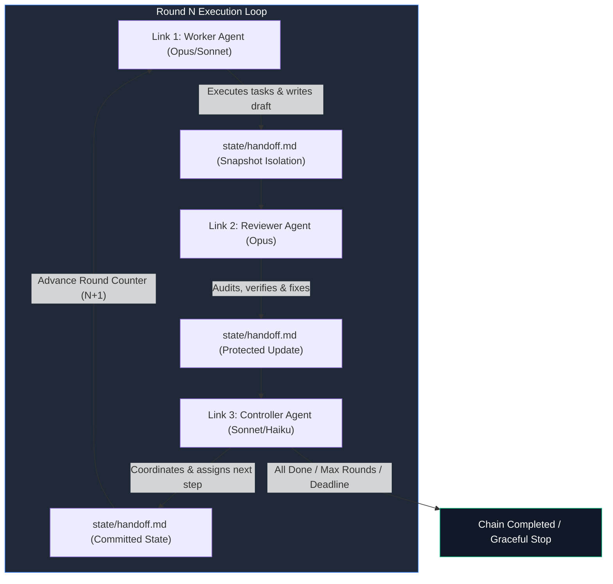
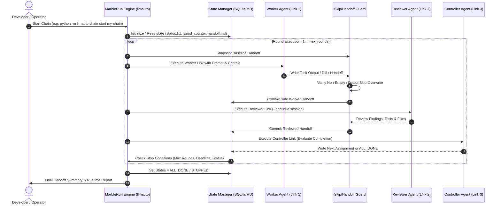

# llmauto -- LLM Automation Framework (MarbleRun)

**English** | [Deutsch](README_de.md)

*Local-first multi-agent orchestration and chain-execution framework from [ellmos-ai](https://github.com/ellmos-ai).*

Universal automation tool for autonomous LLM agent chains ("marble runs"). Sequential agent loops, prompt management, persistent state machines, and unattended execution cycles.

**Canonical Search Name:** `ellmos MarbleRun` or `llmauto`.
This repository is not the confidential-computing project `edgelesssys/marblerun` and not a physics toy, but an orchestration framework for autonomous LLM agent chains.

[](https://github.com/ellmos-ai/MarbleRun)
[](https://github.com/ellmos-ai/MarbleRun/actions/workflows/tests.yml)
[]()
[](https://python.org)
[](https://github.com/ellmos-ai/MarbleRun)
[](https://github.com/astral-sh/ruff)
[](SECURITY.md)
[](SECURITY.md)
[](SECURITY.md)
[](THIRD_PARTY_LICENSES.md)
[](MARKETING-LOG.txt)
[](LICENSE)
[](https://github.com/ellmos-ai)
[](https://github.com/open-bricks)
[](llms.txt)

---

## Quick Navigation

- [1. Executive Summary & Core Identity](#what-is-llmauto)
- [2. Visual Showcase & System Architecture](#visual-showcase--system-architecture)
- [3. Tactical Round Execution & Sequence Flow](#tactical-round-execution--sequence-flow)
- [4. Target Personas & Discoverability Queries](#target-personas--discoverability-queries)
- [5. Comparative Matrix vs. Alternatives](#comparative-matrix--alternatives)
- [6. Governance & Runtime Invariants Matrix](#governance--runtime-invariants-matrix)
- [7. Chain Patterns & Role Matrix](#chain-patterns--role-matrix)
- [8. Installation & Prerequisites](#installation--prerequisites)
- [9. Step-by-Step Quickstart](#step-by-step-quickstart)
- [10. Pipe Mode & Ad-hoc Execution](#pipe-mode--ad-hoc-execution)
- [11. CLI Reference & Global Configuration](#cli-reference--global-configuration)
- [12. Sibling Tools & Ecosystem Matrix](#sibling-tools--ecosystem-matrix)
- [13. Third-Party Licenses & Level 1 SBOM](#third-party-licenses--transparency)
- [14. Security Policy & Operational Limits](#security-policy--operational-limits)
- [15. Repository Structure & Key Assets](#repository-structure--key-assets)
- [16. Development, Test Matrix & Verification](#development--test-matrix)
- [17. Discovery Keywords & Disambiguation](#discovery--keywords--disambiguation)
- [18. Statutory Notice, Liability Limitation & License (§ 521 BGB)](#statutory-notice--liability-limitation)

> [!NOTE]
> **For AI Agents & Automated Tools:** Machine-readable architecture summary, discovery anchors, and usage guidelines are available in [`llms.txt`](llms.txt).

**Author:** Lukas Geiger | **License:** MIT | **Python:** 3.10+ | **Status:** Production-Ready

---

<a id="what-is-llmauto"></a>
## 1. Executive Summary & Core Identity

llmauto orchestrates autonomous LLM agent chains ("marble runs"). Multiple agents work in sequence -- workers execute tasks, reviewers check results, controllers coordinate -- passing context via handoff files.

Provider selection is per chain link. Claude remains the default; Codex and Agy run through the shared COMA adapter layer, while Kimi stays fail-closed until a model/login is configured:

```json
{
  "name": "reviewer",
  "role": "reviewer",
  "backend": "codex",
  "model": "gpt-5.6-sol",
  "prompt": "prompts/example_reviewer.txt"
}
```

Install the optional provider bridge with `pip install -e ".[providers]"`.

Think of it as a marble run: the marble (context) rolls from link to link in a loop, with each link being an LLM agent with a specific role and prompt.

### Key Features

- **Chain Execution:** Define multi-agent chains in JSON, run them autonomously
- **Marble Run Pattern:** Sequential agent loops with handoff-based context passing
- **Multi-Model Support:** Mix Claude Opus, Sonnet, and Haiku in a single chain
- **Role System:** Workers, Reviewers, Controllers with skip-if-not-assigned patterns
- **State Management:** Persistent round counters, handoff files, stop/resume support
- **Pipe Mode:** Single LLM calls from the command line
- **Background Execution:** Start chains in separate terminal windows
- **Telegram Notifications:** Optional status updates via Telegram bot
- **Zero Dependencies:** Pure Python stdlib (`subprocess`, `json`, `pathlib`, `sqlite3`)

### Requirements

- Python 3.10+
- [Claude Code CLI](https://docs.anthropic.com/en/docs/claude-code) (`claude` command available in PATH)

---

<a id="visual-showcase--system-architecture"></a><a id="visual-showcase--execution-flow"></a>
## 2. Visual Showcase & System Architecture

The core architecture follows a cyclic marble-run pipeline where each agent is an autonomous step passing verified state:



---

<a id="tactical-round-execution--sequence-flow"></a>
## 3. Tactical Round Execution & Sequence Flow

The execution cycle coordinates process isolation, baseline snapshotting, anti-overwrite protection, and persistent state transitions:



---

<a id="target-personas--discoverability-queries"></a><a id="target-personas"></a>
## 4. Target Personas & Discoverability Queries

| Persona ID | Target Audience | Primary Needs & Operational Pain Points | High-Intent Discoverability Queries |
| :--- | :--- | :--- | :--- |
| `[PERSONA-01]` | **Autonomous AI Agent Engineers & Chain Builders** | Requires unattended, cyclic multi-agent execution loops where workers, reviewers, and controllers collaborate for hours without manual prompt re-entry or session stalls. | `claude code agent chain runner`, `llmauto claude automation`, `unattended multi agent loop python`, `autonomous coding agent supervisor` |
| `[PERSONA-02]` | **Multi-Agent Swarm & Handoff Architects** | Needs clean context passing between heterogeneous models (e.g. Sonnet worker, Opus reviewer, Haiku controller) with anti-starvation skip protection and baseline rollback. | `llm handoff file pattern python`, `worker reviewer controller multi agent loop`, `skip overwrite protection llm context`, `stateless agent handoff` |
| `[PERSONA-03]` | **Enterprise Tooling, Safety & Governance Compliance Officers** | Requires 100% offline, local-first execution (`Zero-Egress`), non-elevated user privilege (`RunAsInvoker`), permissive open-source licensing, and dual security response SLAs. | `local first ai agent orchestration zero egress`, `runasinvoker llm automation framework`, `enterprise compliant agent chains python`, `permissive license ai agent runner` |
| `[PERSONA-04]` | **Open-Source AI Tool Builders & Local-First Developers** | Demands lightweight, zero-dependency Python tooling that wraps local LLM CLIs directly via standard library primitives without requiring heavy heavyweight node or cloud dependencies. | `zero dependency llm orchestration python`, `claude cli wrapper python stdlib`, `lightweight agent chain framework`, `marble run ai agent loop` |

---

<a id="comparative-matrix--alternatives"></a><a id="see-also-openclaw"></a>
## 5. Comparative Matrix vs. Alternatives

| Architectural Dimension | `MarbleRun (llmauto)` | LangGraph / LangChain | CrewAI | AutoGen (Microsoft) | Invariant Alignment |
| :--- | :--- | :--- | :--- | :--- | :--- |
| **Runtime Dependencies** | **Zero** (100% Python standard library) | Heavy (hundreds of pip packages) | Heavy (Pydantic, LangChain stack) | Moderate-to-heavy dependency tree | `INV-LOCAL-01` |
| **Privilege Model** | `RunAsInvoker` (unprivileged user space) | Unenforced script context | Process execution with loose sandbox | Docker / container-focused runtime | `INV-SEC-02` |
| **Backend Isolation** | Multi-Provider Fail-Closed (Claude, Codex, Agy) | Dynamic provider switching with fallbacks | Provider abstraction with loose validation | Multi-provider with complex configuration | `INV-GATE-03` |
| **Concurrency & Workers** | Race-Free per-worker handoff workspaces | Thread / async task pool | Asynchronous tasks with shared state | Conversation threads and event loops | `INV-SYNC-04` |
| **Context Starvation Guard** | Anti-starvation skip detection & auto-restore | Missing (overwritten on empty output) | Retries upon failure | Conversational loop recovery | `INV-CONT-05` |
| **State Persistence** | Transparent plain-text & Markdown files | SQLite / Postgres checkpointers | In-memory or proprietary SQLite state | In-memory or cache databases | `INV-STATE-06` |
| **Invocation Safety** | Direct vector execution (`shell=False`) | Shell tools commonly enabled | Python execution tools available | Code execution environment | `INV-PROC-07` |
| **Cross-Platform CI Matrix** | Automated Linux, Windows, macOS (3.10-3.13) | Standard CI matrix | Standard CI matrix | Multi-OS CI matrix | `INV-CI-08` |
| **CI Concurrency Gate** | Strict `cancel-in-progress` gate | Standard workflow triggers | Standard workflow triggers | Concurrency controls | `INV-CONC-09` |
| **Security Governance** | Formal 48h SLA & public advisory workflow | General open-source issue tracker | Venture-backed commercial SLA | Enterprise security reporting | `INV-SLA-10` |

### Architectural Spotlight: MarbleRun vs. OpenClaw

MarbleRun makes LLMs act -- autonomous multi-agent chains where workers, reviewers, and controllers collaborate in loops. How does it compare to [OpenClaw](https://github.com/openclaw/openclaw)?

| Dimension | **MarbleRun (llmauto)** | **OpenClaw** |
|---|---|---|
| **Focus** | Autonomous multi-agent orchestration -- make LLMs act | Personal AI assistant -- conversational gateway |
| **Execution** | Multi-agent chains: Worker -> Reviewer -> Controller loops | Single-agent responding to messages |
| **Autonomy** | Fully autonomous -- chains run for hours unattended (rounds, deadlines, shutdown conditions) | Reactive -- responds to user input, cron/webhooks for automation |
| **Multi-model** | Mix Opus, Sonnet, Haiku in one chain with role-based assignment | Model selection per session, failover support |
| **State** | Handoff files, round counters, persistent sessions (`continue` mode) | Session history with `/compact` summarization |
| **Dependencies** | Zero -- pure Python stdlib + Claude Code CLI | Node.js 22+, numerous npm packages |
| **License** | MIT | MIT |

**In short:** OpenClaw connects LLMs to conversations. MarbleRun connects LLMs to each other -- creating autonomous work loops where agents collaborate, review, and iterate without human intervention.

---

<a id="governance--runtime-invariants-matrix"></a><a id="core-capabilities--security-invariants"></a>
## 6. Governance & Runtime Invariants Matrix

MarbleRun is built on strict local-first, zero-egress, and resilient execution guarantees:

| Invariant ID & Capability | Implementation Mechanism | Security & Reliability Guarantee |
|---|---|---|
| **INV-LOCAL-01: 100% Offline / Zero-Egress** | Local CLI orchestration via `subprocess` without external network listeners | Zero data egress; agent context and prompts remain entirely on local machine |
| **INV-SEC-02: Non-Elevation & User Mode** | Standard Python runtime execution without root/admin privilege requirements (`RunAsInvoker`) | Prevents unauthorized system modification; safe sandboxed CLI execution |
| **INV-GATE-03: Multi-Provider Fail-Closed** | Strict backend selection (Claude CLI, optional COMA adapter for Codex/Agy) | Unconfigured backends fail closed; no silent fallback to insecure endpoints |
| **INV-SYNC-04: Race-Free Parallel Workers** | Per-worker isolated handoff snapshots (`tests/test_parallel_handoff.py`) | Prevents concurrency collisions when parallel agents write simultaneous outputs |
| **INV-CONT-05: Skip-Overwrite Guard** | Automated baseline snapshot restoration on short `SKIPPED` responses | Prevents context starvation; preserves valuable upstream context across links |
| **INV-STATE-06: Persistent State Machine** | Transparent filesystem artifacts (`status.txt`, `round_counter.txt`, `handoff.md`) | Resumable across reboots; zero proprietary binary lock-in; human-inspectable |
| **INV-PROC-07: Safe Process Scoping & Shell-Free Execution** | Direct `argv` execution (`shell=False`) with sanitized environment maps | Eliminates shell-injection vectors, command injection, and untracked side-effects |
| **INV-CI-08: Multi-OS CI Matrix** | Automated GitHub Actions testing across Ubuntu, Windows, and macOS | Guaranteed cross-platform consistency on Python 3.10, 3.11, 3.12, and 3.13 |
| **INV-CONC-09: Strict Concurrency Gate** | Workflow-level `concurrency` with `cancel-in-progress: true` | Prevents stale CI race conditions and wasted compute resources |
| **INV-SLA-10: Cryptographic Receipt Integrity & Security SLA Auditability** | Timestamped state transitions, 48h SLA response commitment, and deterministic tests | Tamper-evident audit trails, guaranteed triage within 5 days, verified compliance |

---

<a id="chain-patterns--role-matrix"></a>
## 7. Chain Patterns & Role Matrix

| Role | Primary Responsibility | Recommended Model | Context Retention |
|---|---|---|---|
| `worker` | Executes feature code, fixes, documentation, refactoring | `claude-sonnet-4-6` | Fresh session per round or isolated handoff |
| `reviewer` | Audits code quality, executes test suites, identifies regressions | `claude-opus-4-6` | `continue: true` for persistent project context |
| `controller` | Evaluates overall milestone progress, routes tasks, triggers shutdown | `claude-sonnet-4-6` / `haiku` | Evaluates criteria against `max_rounds` & deadline |

### Shutdown Conditions

A chain stops when any of these conditions are met:

- `runtime_hours` exceeded
- `max_rounds` reached
- `status.txt` contains "STOPPED" or "ALL_DONE"
- `max_consecutive_blocks` consecutive BLOCK states
- Manual stop via `llmauto chain stop`

### State Files

Each chain maintains persistent state in `state/<chain-name>/`:

| File | Purpose |
|------|---------|
| `status.txt` | READY, RUNNING, STOPPED, ALL_DONE, BLOCKED |
| `round_counter.txt` | Current round number |
| `handoff.md` | Context handoff between links |
| `start_time.txt` | When the chain was started |

### Chain Configuration Schema

| Field | Type | Description |
|-------|------|-------------|
| `description` | string | Human-readable description |
| `mode` | string | `loop` (repeat), `once` (single pass), `deadend` (single pass) |
| `max_rounds` | int | Maximum number of complete cycles |
| `runtime_hours` | float | Maximum runtime in hours |
| `deadline` | string | Hard deadline (ISO date) |
| `defaults` | object | Chain-wide runner defaults for permissions, tools, timeout, and environment |
| `links` | array | Ordered list of chain links |

### Link Configuration

| Field | Type | Description |
|-------|------|-------------|
| `name` | string | Unique link identifier |
| `role` | string | `worker`, `reviewer`, `controller` |
| `model` | string | Claude model ID |
| `prompt` | string | Prompt template filename or inline text |
| `continue` | bool | Use `--continue` flag (persistent session) |
| `fallback_model` | string | Fallback model if primary fails |
| `until_full` | bool | Add context-limit awareness suffix |
| `telegram_update` | bool | Send Telegram notification after this link |
| `permission_mode` | string | Optional override of the chain/global permission mode |
| `allowed_tools` | array | Optional per-link tool allowlist, including MCP tools |
| `timeout_seconds` | int | Optional per-link timeout override |
| `env` | object | Optional per-link environment merged over chain and global values |

Runner settings resolve consistently in this order: link override, chain `defaults`, then global `config.json`. Environment objects are merged in the same order and support `{HOME}` and `{BASH_HOME}` placeholders.

### Advanced Patterns

#### Skip-If-Not-Assigned

For chains where a controller assigns work to either an Opus or Sonnet worker:

```json
{
  "links": [
    {"name": "controller", "role": "controller", "model": "opus"},
    {"name": "opus-worker", "role": "worker", "model": "opus"},
    {"name": "sonnet-worker", "role": "worker", "model": "sonnet"}
  ]
}
```

The controller writes `ASSIGNED: opus` or `ASSIGNED: sonnet` in the handoff. The non-assigned worker reads the handoff and skips immediately.

#### Continue Mode

Links with `"continue": true` maintain a persistent Claude Code session in a dedicated workspace directory. Each invocation continues the previous conversation, preserving full context.

#### Template Variables

Prompts support `{HOME}` (Windows path) and `{BASH_HOME}` (Unix path) placeholders that are resolved at runtime.

---

<a id="installation--prerequisites"></a><a id="installation"></a>
## 8. Installation & Prerequisites

```bash
git clone https://github.com/ellmos-ai/MarbleRun.git
cd MarbleRun

# Run directly (zero installation required, pure stdlib)
python -m llmauto --help

# Or install as editable package
pip install -e .
llmauto --help

# Optional: install provider bridge for Codex / Agy backends
pip install -e ".[providers]"
```

---

<a id="step-by-step-quickstart"></a><a id="1-define-a-chain"></a>
## 9. Step-by-Step Quickstart

### 1. Create a Chain Definition

Create a JSON file in `chains/` (e.g. `chains/my-chain.json`):

```json
{
  "description": "Simple worker-reviewer loop",
  "mode": "loop",
  "max_rounds": 5,
  "runtime_hours": 2,
  "links": [
    {
      "name": "worker",
      "role": "worker",
      "model": "claude-sonnet-4-6",
      "prompt": "worker_prompt.txt"
    },
    {
      "name": "reviewer",
      "role": "reviewer",
      "model": "claude-opus-4-6-20250918",
      "prompt": "reviewer_prompt.txt",
      "continue": true
    }
  ]
}
```

### 2. Create Prompt Templates

Place prompt files in `prompts/` (e.g. `prompts/worker_prompt.txt`):

```text
You are a software development worker. Read the handoff file at
state/my-chain/handoff.md for your current assignment.

Execute the assigned tasks, then write a handoff for the reviewer:
- What you completed
- What needs review
- Any blockers
```

### 3. Run the Chain

```bash
# Start in foreground
python -m llmauto chain start my-chain

# Start in background (opens new terminal window)
python -m llmauto chain start my-chain --bg

# Check status
python -m llmauto chain status my-chain

# Stop gracefully (after current link finishes)
python -m llmauto chain stop my-chain "Reason for stopping"

# View logs
python -m llmauto chain log my-chain 50

# Reset state (back to round 0)
python -m llmauto chain reset my-chain
```

---

<a id="pipe-mode--ad-hoc-execution"></a><a id="4-pipe-mode-single-calls"></a>
## 10. Pipe Mode & Ad-hoc Execution

Single LLM calls executed directly from your terminal or shell scripts:

```bash
# Direct prompt
python -m llmauto pipe "Explain quantum computing in 3 sentences"

# From file
python -m llmauto pipe -f prompt.txt

# With model override
python -m llmauto pipe "Hello" --model claude-opus-4-6-20250918
```

---

<a id="cli-reference--global-configuration"></a><a id="cli-reference"></a>
## 11. CLI Reference & Global Configuration

### CLI Command Reference

| Command | Arguments | Description |
|---|---|---|
| `python -m llmauto chain start <name>` | `[--bg]` | Starts a chain in foreground or new background terminal window |
| `python -m llmauto chain status <name>` | | Displays current round, execution status, and active link |
| `python -m llmauto chain stop <name>` | `[reason]` | Gracefully stops chain after current link finishes |
| `python -m llmauto chain log <name>` | `[lines]` | Shows recent log output (default: 50 lines) |
| `python -m llmauto chain reset <name>` | | Resets round counter and state back to round 0 |
| `python -m llmauto chain create` | | Interactive CLI wizard for generating new chain configurations |
| `python -m llmauto pipe <prompt>` | `[-f file] [--model ID]` | Executes a single-shot prompt directly via CLI |

### Global Configuration (`config.json`)

| Setting | Default | Description |
|---|---|---|
| `default_model` | `claude-sonnet-4-6` | Primary model ID for links without explicit override |
| `default_permission_mode` | `dontAsk` | Unattended execution permission level |
| `default_allowed_tools` | `Read, Edit, Write, Bash, Glob, Grep` | Whitelisted Claude Code capabilities |
| `default_timeout_seconds` | `7200` (2h) | Maximum execution timeout per link |
| `telegram.enabled` | `false` | Optional Telegram status and completion reporting |

### Included Example Chains

llmauto ships with production-tested chain configurations:

| Chain | Pattern | Description |
|---|---|---|
| `worker-reviewer-loop` | Template | Basic 2-link worker/reviewer pattern |
| `gui-live-test` | Template | One-pass Open Compute desktop test with persistent evidence |

---

<a id="sibling-tools--ecosystem-matrix"></a><a id="sibling-tools--ecosystem"></a>
## 12. Sibling Tools & Ecosystem Matrix

MarbleRun is part of the `ellmos-ai`, `dev-bricks`, `file-bricks`, `entertain-and-more`, and `open-bricks` ecosystem of modular developer tools and agent orchestration components:

| Tool | Ecosystem | Purpose |
|---|---|---|
| [COMA](https://github.com/ellmos-ai/coma) | `ellmos-ai` | Multi-provider LLM CLI orchestrator & adapter framework |
| [policy-registry](https://github.com/ellmos-ai/policy-registry) | `ellmos-ai` | Governance policy engine and signed agent delegation framework |
| [system-explorer](https://github.com/ellmos-ai/system-explorer) | `ellmos-ai` | Multi-agent system topology explorer & runtime inspector |
| [sqlite-transit-sync](https://github.com/ellmos-ai/sqlite-transit-sync) | `ellmos-ai` | Local SQLite state synchronizer for distributed agent workflows |
| [ellmos-clatcher-mcp](https://github.com/ellmos-ai/ellmos-clatcher-mcp) | `ellmos-ai` | Multi-agent context caching & snapshot bridge MCP server |
| [automation-master](https://github.com/dev-bricks/automation-master) | `dev-bricks` | Local-first credit reservation & background automation daemon |
| [DevCenter](https://github.com/dev-bricks/DevCenter) | `dev-bricks` | Multi-repo developer workbench & agent telemetry cockpit |
| [CodeBox](https://github.com/dev-bricks/CodeBox) | `dev-bricks` | Sandboxed multi-language code execution engine |
| [FileCommander](https://github.com/file-bricks/FileCommander) | `file-bricks` | High-performance batch file processing & metadata management |
| [ProFiler](https://github.com/file-bricks/ProFiler) | `file-bricks` | Deep filesystem inspection, duplicate detection & forensics |
| [CuteStrike](https://github.com/entertain-and-more/CuteStrike) | `entertain-and-more` | Local-first non-violent tactical arena game with autonomous AI bots |
| [open-bricks](https://github.com/open-bricks) | `open-bricks` | Umbrella organization & architectural standards for open tools |

---

<a id="third-party-licenses--transparency"></a><a id="drittanbieter-lizenzen--transparenz"></a>
## 13. Third-Party Licenses & Level 1 SBOM

MarbleRun (`llmauto`) is engineered with zero mandatory external runtime dependencies. The core agent loop, CLI runner, and process orchestration operate solely on the Python Standard Library ([PSFL-2.0](https://docs.python.org/3/license.html)).

All optional integrations and development tools are 100% permissively licensed:
- **Core Engine:** 100% Python Standard Library ([PSFL-2.0](https://docs.python.org/3/license.html)) -- zero external runtime packages.
- **Optional Provider Bridge:** [`coma`](https://github.com/dev-bricks/coma) ([MIT](https://github.com/dev-bricks/coma/blob/main/LICENSE)) for Codex and Agy adapters.
- **Testing & Quality Assurance:** [`pytest`](https://github.com/pytest-dev/pytest) (MIT), [`ruff`](https://github.com/astral-sh/ruff) (MIT / Apache-2.0), [`setuptools`](https://github.com/pypa/setuptools) (MIT), and [`setuptools-scm`](https://github.com/pypa/setuptools-scm) (MIT).

Zero copyleft, GPL, or AGPL dependencies are included. Detailed dependency notices, provenance audits, and full license texts are maintained in [THIRD_PARTY_LICENSES.md](THIRD_PARTY_LICENSES.md). Formal repository notice is in [NOTICE](NOTICE).

---

<a id="security-policy--operational-limits"></a>
## 14. Security Policy & Operational Limits

MarbleRun enforces a strict local-first security boundary:
- **Zero-Egress by Default:** Pure standard library execution with zero background network requests or telemetry.
- **RunAsInvoker Isolation:** Strictly executes in unprivileged user space. Does not require administrative elevation or daemon services.
- **Supported Versions & SLAs:** Version 0.1.x is actively supported with a 48h initial acknowledgment SLA and 5 business days triage target.
- **Vulnerability Reporting:** Disclosures are handled confidentially via `security@ellmos.ai`, `security@open-bricks.org`, or through [GitHub Security Advisories](https://github.com/ellmos-ai/MarbleRun/security/advisories/new). Full policy details: [SECURITY.md](SECURITY.md).

---

<a id="repository-structure--key-assets"></a>
## 15. Repository Structure & Key Assets

```
MarbleRun/
├── llmauto/                   # Core Python package & CLI entry points
│   ├── llmauto.py             # Main CLI dispatcher (chain, pipe, inspect)
│   ├── core/                  # Engine internals
│   │   ├── runner.py          # Claude CLI & provider invocation (subprocess, env, fallback)
│   │   ├── config.py          # Chain & global JSON configuration parser
│   │   └── state.py           # Handoff files, round counters, shutdown triggers
│   └── modes/                 # Execution modes (chain runner, pipe)
│       └── chain.py           # Cyclic marble-run engine
├── chains/                    # Example & production chain configurations (JSON)
├── prompts/                   # Reusable prompt templates per chain role
├── templates/                 # Chain pattern blueprints (worker-reviewer, gui-live-test)
├── tests/                     # Comprehensive contract & integration test suite
├── docs/                      # Architecture notes & playtest evidence
├── CHANGELOG.md               # Versioned changelog & release history
├── LICENSE                    # MIT License
├── NOTICE                     # Product attribution & copyright declaration
├── THIRD_PARTY_LICENSES.md    # Level 1 SBOM & dependency compliance audit
├── MARKETING-LOG.txt          # Discoverability log & SEO queries
├── SECURITY.md                # Bilingual security policy & SLA commitments
├── llms.txt                   # Machine-readable AI agent index & sitemap
└── pyproject.toml             # PEP 621 package manifest & ruff configuration
```

---

<a id="development--test-matrix"></a>
## 16. Development, Test Matrix & Verification

`MarbleRun` maintains a comprehensive automated test suite with 100% green passing status:

```bash
# Run the complete test suite
pytest

# Run with verbose output and summary
pytest -ra -v

# Run code style and linting checks
ruff check .

# Compile Python bytecode across repository
python -m compileall -q .
```

The CI pipeline executes automatically via `.github/workflows/tests.yml` across:
- **Operating Systems:** Ubuntu Latest, Windows Latest, macOS Latest
- **Python Versions:** 3.10, 3.11, 3.12, and 3.13
- **Gates:** Ruff linting, compileall verification, concurrency cancel-in-progress, and 15-minute execution timeout guard.

---

<a id="discovery--keywords--disambiguation"></a><a id="best-search-phrases"></a>
## 17. Discovery Keywords & Disambiguation

Use these phrases when looking for the project in search engines, GitHub search, LLM tool indexes, or internal automation documentation:

| Phrase | Why it matters |
|---|---|
| `ellmos MarbleRun` | Distinguishes this repo from confidential-computing and game projects named MarbleRun |
| `llmauto Claude Code automation` | Finds the package and CLI name used in code |
| `MarbleRun LLM agent chains` | Describes the central chain-execution pattern |
| `local-first multi-agent orchestration Python` | Captures the zero-dependency local automation use case |
| `Claude Code agent chain runner` | Matches users searching for unattended Claude Code worker/reviewer/controller loops |
| `llmauto autonomous agent loop` | Combines the CLI/package name with the core automation pattern |

### Disambiguation Notice

MarbleRun is best discovered through its CLI/package name `llmauto` plus the use case: Claude Code automation, agent-chain runner, local-first multi-agent orchestration, and handoff-based autonomous work loops. The bare name `MarbleRun` is intentionally disambiguated because public search results also include confidential-computing infrastructure and physical marble-run projects.

---

<a id="statutory-notice--liability-limitation"></a><a id="license"></a>
## 18. Statutory Notice, Liability Limitation & License (§ 521 BGB)

### Statutory Disclaimer (§ 521 BGB Gefälligkeitsrecht)

Dieses Open-Source-Softwareprodukt wird als **unentgeltliche Schenkung** im Sinne der §§ 516 ff. BGB bereitgestellt. Gemäß **§ 521 BGB** ist die Haftung des Urhebers und der Beitragenden auf **Vorsatz und grobe Fahrlässigkeit** beschränkt. Ergänzend gelten die nachstehenden Haftungsausschlüsse der MIT-Lizenz.

Nutzung auf eigenes Risiko. Keine Wartungsverpflichtung, keine Verfügbarkeitszusicherung, keine Gewähr für Fehlerfreiheit oder Eignung für einen bestimmten Einsatzzweck.

### English Summary

This project is an unpaid open-source donation. In accordance with § 521 of the German Civil Code (BGB), liability is restricted strictly to cases of intentional misconduct and gross negligence. Supplemental liability disclaimers are set forth in the MIT License below.

Use entirely at your own risk. No maintenance commitments, no availability guarantees, and no warranties regarding fitness for any particular purpose.

### License

Distributed under the terms of the [MIT License](LICENSE).
Copyright (c) 2026 Lukas Geiger. See [LICENSE](LICENSE) and [NOTICE](NOTICE) for full details.
Third-party licenses and compliance notices are audited in [THIRD_PARTY_LICENSES.md](THIRD_PARTY_LICENSES.md).
