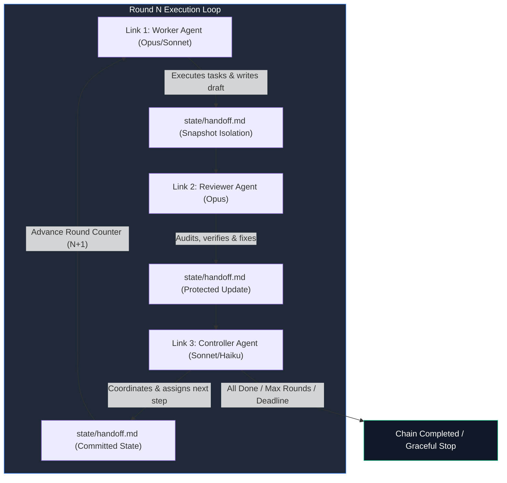
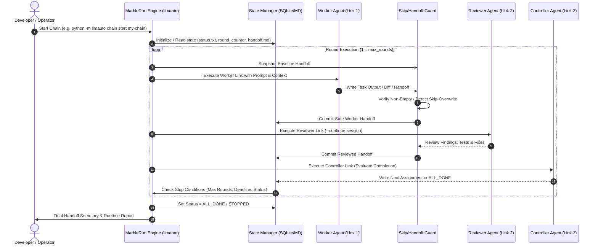

# llmauto -- LLM Automation Framework (MarbleRun)

**🇩🇪 [Deutsche Version](README_de.md)**

*Local-first multi-agent orchestration & chain-execution framework by [ellmos-ai](https://github.com/ellmos-ai).*

Universal automation tool for autonomous LLM agent chains ("marble runs").
Sequential agent loops, prompt management, state persistence, and unattended work cycles.

**Canonical search name:** `ellmos MarbleRun` or `llmauto`.
This repository is not the confidential-computing project `edgelesssys/marblerun`
and not a marble-run game toolkit; it is a Python/Claude Code automation
framework for autonomous LLM agent chains.

[](https://github.com/ellmos-ai/MarbleRun)
[](https://github.com/ellmos-ai/MarbleRun/actions/workflows/tests.yml)
[]()
[]()
[]()
[]()
[](SECURITY.md)
[](LICENSE)
[](https://github.com/ellmos-ai)
[](https://github.com/open-bricks)
[](llms.txt)

> [!NOTE]
> **For AI Agents & Automated Tools:** Machine-readable architecture summary, discovery anchors, and usage guidelines are available in [`llms.txt`](llms.txt).

**Author:** Lukas Geiger | **License:** MIT | **Python:** 3.10+ | **Navigation:** [Overview](#what-is-llmauto) • [Quick Start](#quick-start) • [Visual Showcase](#visual-showcase--execution-flow) • [Sequence Flow](#tactical-round-execution--sequence-flow) • [Core Capabilities & Security](#core-capabilities--security-invariants) • [Chain Patterns & Roles](#chain-patterns--role-matrix) • [CLI Reference](#cli-reference) • [Search Phrases](#best-search-phrases) • [Comparison](#see-also-openclaw) • [Sibling Ecosystem](#sibling-tools--ecosystem) • [Security Policy](SECURITY.md) • [Liability](#liability)


---

## What is llmauto?

llmauto orchestrates autonomous LLM agent chains ("marble runs"). Multiple agents work in sequence -- workers execute tasks, reviewers check results, controllers coordinate -- passing context via handoff files.

Provider selection is per chain link. Claude remains the default; Codex and Agy
run through the shared COMA adapter layer, while Kimi stays fail-closed until a
model/login is configured:

```json
{
  "name": "reviewer",
  "role": "reviewer",
  "backend": "codex",
  "model": "gpt-5.6-sol",
  "prompt": "prompts/example_reviewer.txt"
}
```

Install the optional provider bridge with `pip install -e ".[providers]"`.

Think of it as a marble run: the marble (context) rolls from link to link in a loop, with each link being an LLM agent with a specific role and prompt.

### Best Search Phrases

Use these phrases when looking for the project in search engines, GitHub search,
LLM tool indexes, or internal automation docs:

| Phrase | Why it matters |
|---|---|
| `ellmos MarbleRun` | Distinguishes this repo from confidential-computing and game projects named MarbleRun |
| `llmauto Claude Code automation` | Finds the package and CLI name used in code |
| `MarbleRun LLM agent chains` | Describes the central chain-execution pattern |
| `local-first multi-agent orchestration Python` | Captures the zero-dependency local automation use case |
| `Claude Code agent chain runner` | Matches users searching for unattended Claude Code worker/reviewer/controller loops |
| `llmauto autonomous agent loop` | Combines the CLI/package name with the core automation pattern |

### Discovery Context

MarbleRun is best discovered through its CLI/package name `llmauto` plus the
use case: Claude Code automation, agent-chain runner, local-first multi-agent
orchestration, and handoff-based autonomous work loops. The bare name
`MarbleRun` is intentionally disambiguated because public search results also
include confidential-computing infrastructure and physical marble-run projects.

### Key Features

- **Chain Execution:** Define multi-agent chains in JSON, run them autonomously
- **Marble Run Pattern:** Sequential agent loops with handoff-based context passing
- **Multi-Model Support:** Mix Claude Opus, Sonnet, and Haiku in a single chain
- **Role System:** Workers, Reviewers, Controllers with skip-if-not-assigned patterns
- **State Management:** Persistent round counters, handoff files, stop/resume support
- **Pipe Mode:** Single LLM calls from the command line
- **Background Execution:** Start chains in separate terminal windows
- **Telegram Notifications:** Optional status updates via Telegram bot
- **Zero Dependencies:** Pure Python stdlib (subprocess, json, pathlib, sqlite3)

### Requirements

- Python 3.10+
- [Claude Code CLI](https://docs.anthropic.com/en/docs/claude-code) (`claude` command available in PATH)

---

## Installation

```bash
git clone https://github.com/ellmos-ai/MarbleRun.git
cd MarbleRun

# Run directly (no install needed)
python -m llmauto --help

# Or install as package
pip install -e .
llmauto --help
```

---

## Quick Start

### 1. Create a Chain Definition

Create a JSON file in `chains/` (e.g. `chains/my-chain.json`):

```json
{
  "description": "Simple worker-reviewer loop",
  "mode": "loop",
  "max_rounds": 5,
  "runtime_hours": 2,
  "links": [
    {
      "name": "worker",
      "role": "worker",
      "model": "claude-sonnet-4-6",
      "prompt": "worker_prompt.txt"
    },
    {
      "name": "reviewer",
      "role": "reviewer",
      "model": "claude-opus-4-6-20250918",
      "prompt": "reviewer_prompt.txt",
      "continue": true
    }
  ]
}
```

### 2. Create Prompt Templates

Place prompt files in `prompts/` (e.g. `prompts/worker_prompt.txt`):

```text
You are a software development worker. Read the handoff file at
state/my-chain/handoff.md for your current assignment.

Execute the assigned tasks, then write a handoff for the reviewer:
- What you completed
- What needs review
- Any blockers
```

### 3. Run the Chain

```bash
# Start in foreground
python -m llmauto chain start my-chain

# Start in background (opens new terminal window)
python -m llmauto chain start my-chain --bg

# Check status
python -m llmauto chain status my-chain

# Stop gracefully (after current link finishes)
python -m llmauto chain stop my-chain "Reason for stopping"

# View logs
python -m llmauto chain log my-chain 50

# Reset state (back to round 0)
python -m llmauto chain reset my-chain
```

### 4. Pipe Mode (Single Calls)

```bash
# Direct prompt
python -m llmauto pipe "Explain quantum computing in 3 sentences"

# From file
python -m llmauto pipe -f prompt.txt

# With model override
python -m llmauto pipe "Hello" --model claude-opus-4-6-20250918
```

---

## Visual Showcase & Execution Flow

The core architecture follows a cyclic marble-run pipeline where each agent is an autonomous step passing verified state:



---

## Tactical Round Execution & Sequence Flow

The execution cycle coordinates process isolation, baseline snapshotting, anti-overwrite protection, and persistent state transitions:



---

## Core Capabilities & Security Invariants

MarbleRun is built on strict local-first, zero-egress, and resilient execution guarantees:

| Capability / Invariant | Implementation Mechanism | Security & Reliability Guarantee |
|---|---|---|
| **100% Offline / Zero-Egress** | Local CLI orchestration via `subprocess` without external network listeners | Zero data egress; agent context and prompts remain entirely on local machine |
| **Non-Elevation & User Mode** | Standard Python runtime execution without root/admin privilege requirements | Prevents unauthorized system modification; safe sandboxed CLI execution |
| **Multi-Provider Fail-Closed** | Strict backend selection (Claude CLI, optional COMA adapter for Codex/Agy) | Unconfigured backends fail closed; no silent fallback to insecure endpoints |
| **Race-Free Parallel Workers** | Per-worker isolated handoff snapshots (`tests/test_parallel_handoff.py`) | Prevents concurrency collisions when parallel agents write simultaneous outputs |
| **Skip-Overwrite Guard** | Automated baseline snapshot restoration on short `SKIPPED` responses | Prevents context starvation; preserves valuable upstream context across links |
| **Persistent State Machine** | Transparent filesystem artifacts (`status.txt`, `round_counter.txt`, `handoff.md`) | Resumable across reboots; zero proprietary binary lock-in; human-inspectable |
| **Multi-OS CI Matrix** | Automated GitHub Actions testing across Ubuntu, Windows, and macOS | Guaranteed cross-platform consistency on Python 3.10, 3.11, 3.12, and 3.13 |
| **Strict Concurrency Gate** | Workflow-level `concurrency` with `cancel-in-progress: true` | Prevents stale CI race conditions and wasted compute resources |

---

## Chain Patterns & Role Matrix

| Role | Primary Responsibility | Recommended Model | Context Retention |
|---|---|---|---|
| `worker` | Executes feature code, fixes, documentation, refactoring | `claude-sonnet-4-6` | Fresh session per round or isolated handoff |
| `reviewer` | Audits code quality, executes test suites, identifies regressions | `claude-opus-4-6` | `continue: true` for persistent project context |
| `controller` | Evaluates overall milestone progress, routes tasks, triggers shutdown | `claude-sonnet-4-6` / `haiku` | Evaluates criteria against `max_rounds` & deadline |

### Shutdown Conditions

A chain stops when any of these conditions are met:

- `runtime_hours` exceeded
- `max_rounds` reached
- `status.txt` contains "STOPPED" or "ALL_DONE"
- `max_consecutive_blocks` consecutive BLOCK states
- Manual stop via `llmauto chain stop`

### State Files

Each chain maintains persistent state in `state/<chain-name>/`:

| File | Purpose |
|------|---------|
| `status.txt` | READY, RUNNING, STOPPED, ALL_DONE, BLOCKED |
| `round_counter.txt` | Current round number |
| `handoff.md` | Context handoff between links |
| `start_time.txt` | When the chain was started |

### Chain Configuration Schema

| Field | Type | Description |
|-------|------|-------------|
| `description` | string | Human-readable description |
| `mode` | string | `loop` (repeat), `once` (single pass), `deadend` (single pass) |
| `max_rounds` | int | Maximum number of complete cycles |
| `runtime_hours` | float | Maximum runtime in hours |
| `deadline` | string | Hard deadline (ISO date) |
| `defaults` | object | Chain-wide runner defaults for permissions, tools, timeout, and environment |
| `links` | array | Ordered list of chain links |

### Link Configuration

| Field | Type | Description |
|-------|------|-------------|
| `name` | string | Unique link identifier |
| `role` | string | `worker`, `reviewer`, `controller` |
| `model` | string | Claude model ID |
| `prompt` | string | Prompt template filename or inline text |
| `continue` | bool | Use `--continue` flag (persistent session) |
| `fallback_model` | string | Fallback model if primary fails |
| `until_full` | bool | Add context-limit awareness suffix |
| `telegram_update` | bool | Send Telegram notification after this link |
| `permission_mode` | string | Optional override of the chain/global permission mode |
| `allowed_tools` | array | Optional per-link tool allowlist, including MCP tools |
| `timeout_seconds` | int | Optional per-link timeout override |
| `env` | object | Optional per-link environment merged over chain and global values |

Runner settings resolve consistently in this order: link override, chain
`defaults`, then global `config.json`. Environment objects are merged in the
same order and support `{HOME}` and `{BASH_HOME}` placeholders.

### Live GUI and Roblox evidence

Use `templates/gui-live-test.json` for a desktop test chain. Open Compute writes
its captures to `OC_SESSION_DIR`. For Roblox Studio, register the lifecycle-safe
wrapper once:

```powershell
claude mcp add --scope user Roblox_Studio -- python C:/_Local_DEV/repos/marblerun/scripts/roblox_mcp_wrapper.py
```

Set `MARBLERUN_EVIDENCE_ROOT` in chain defaults to the project's
`docs/playtests` directory. The wrapper stores each captured image and JSON
provenance in a dated folder and terminates its complete child-process tree when
the client disconnects.

---

## Advanced Patterns

### Skip-If-Not-Assigned

For chains where a controller assigns work to either an Opus or Sonnet worker:

```json
{
  "links": [
    {"name": "controller", "role": "controller", "model": "opus"},
    {"name": "opus-worker", "role": "worker", "model": "opus"},
    {"name": "sonnet-worker", "role": "worker", "model": "sonnet"}
  ]
}
```

The controller writes `ASSIGNED: opus` or `ASSIGNED: sonnet` in the handoff.
The non-assigned worker reads the handoff and skips immediately.

### Continue Mode

Links with `"continue": true` maintain a persistent Claude Code session
in a dedicated workspace directory. Each invocation continues the previous
conversation, preserving full context.

### Template Variables

Prompts support `{HOME}` (Windows path) and `{BASH_HOME}` (Unix path)
placeholders that are resolved at runtime.

---

## Project Structure

```
llmauto/
  llmauto.py              Main CLI entry point
  config.json             Global configuration
  core/
    runner.py             Claude CLI wrapper (subprocess, env, fallback)
    config.py             Config management (chains, global)
    state.py              State management (handoff, rounds, shutdown)
  modes/
    chain.py              Marble run engine
  chains/                 Chain definitions (JSON)
  prompts/                Prompt templates per chain
  state/                  Runtime state per chain (gitignored)
  logs/                   Runtime logs (gitignored)
  templates/              Chain pattern templates
  docs/                   Documentation
```

---

## CLI Reference

| Command | Arguments | Description |
|---|---|---|
| `python -m llmauto chain start <name>` | `[--bg]` | Starts a chain in foreground or new background terminal window |
| `python -m llmauto chain status <name>` | | Displays current round, execution status, and active link |
| `python -m llmauto chain stop <name>` | `[reason]` | Gracefully stops chain after current link finishes |
| `python -m llmauto chain log <name>` | `[lines]` | Shows recent log output (default: 50 lines) |
| `python -m llmauto chain reset <name>` | | Resets round counter and state back to round 0 |
| `python -m llmauto chain create` | | Interactive CLI wizard for generating new chain configurations |
| `python -m llmauto pipe <prompt>` | `[-f file] [--model ID]` | Executes a single-shot prompt directly via CLI |

---

## Global Configuration (config.json)

| Setting | Default | Description |
|---|---|---|
| `default_model` | `claude-sonnet-4-6` | Primary model ID for links without explicit override |
| `default_permission_mode` | `dontAsk` | Unattended execution permission level |
| `default_allowed_tools` | `Read, Edit, Write, Bash, Glob, Grep` | Whitelisted Claude Code capabilities |
| `default_timeout_seconds` | `7200` (2h) | Maximum execution timeout per link |
| `telegram.enabled` | `false` | Optional Telegram status and completion reporting |

---

## Included Example Chains

llmauto ships with production-tested chain configurations:

| Chain | Pattern | Description |
|---|---|---|
| `worker-reviewer-loop` | Template | Basic 2-link worker/reviewer pattern |
| `gui-live-test` | Template | One-pass Open Compute desktop test with persistent evidence |

See `chains/` for the full set of included chain definitions.

---

## See Also: OpenClaw

MarbleRun makes LLMs act -- autonomous multi-agent chains where workers, reviewers, and controllers collaborate in loops. How does it compare to [OpenClaw](https://github.com/openclaw/openclaw)?

| Dimension | **MarbleRun (llmauto)** | **OpenClaw** |
|---|---|---|
| **Focus** | Autonomous multi-agent orchestration -- make LLMs act | Personal AI assistant -- conversational gateway |
| **Execution** | Multi-agent chains: Worker -> Reviewer -> Controller loops | Single-agent responding to messages |
| **Autonomy** | Fully autonomous -- chains run for hours unattended (rounds, deadlines, shutdown conditions) | Reactive -- responds to user input, cron/webhooks for automation |
| **Multi-model** | Mix Opus, Sonnet, Haiku in one chain with role-based assignment | Model selection per session, failover support |
| **State** | Handoff files, round counters, persistent sessions (`continue` mode) | Session history with `/compact` summarization |
| **Dependencies** | Zero -- pure Python stdlib + Claude Code CLI | Node.js 22+, numerous npm packages |
| **License** | MIT | MIT |

**In short:** OpenClaw connects LLMs to conversations. MarbleRun connects LLMs to each other -- creating autonomous work loops where agents collaborate, review, and iterate without human intervention.

---

## Sibling Tools & Ecosystem

MarbleRun is part of the `ellmos-ai`, `dev-bricks`, `file-bricks`, `entertain-and-more`, and `open-bricks` ecosystem of modular developer tools and agent orchestration components:

| Tool | Ecosystem | Purpose |
|---|---|---|
| [COMA](https://github.com/ellmos-ai/coma) | `ellmos-ai` | Multi-provider LLM CLI orchestrator & adapter framework |
| [policy-registry](https://github.com/ellmos-ai/policy-registry) | `ellmos-ai` | Governance policy engine and signed agent delegation framework |
| [system-explorer](https://github.com/ellmos-ai/system-explorer) | `ellmos-ai` | Multi-agent system topology explorer & runtime inspector |
| [sqlite-transit-sync](https://github.com/ellmos-ai/sqlite-transit-sync) | `ellmos-ai` | Local SQLite state synchronizer for distributed agent workflows |
| [ellmos-clatcher-mcp](https://github.com/ellmos-ai/ellmos-clatcher-mcp) | `ellmos-ai` | Multi-agent context caching & snapshot bridge MCP server |
| [automation-master](https://github.com/dev-bricks/automation-master) | `dev-bricks` | Local-first credit reservation & background automation daemon |
| [DevCenter](https://github.com/dev-bricks/DevCenter) | `dev-bricks` | Multi-repo developer workbench & agent telemetry cockpit |
| [CodeBox](https://github.com/dev-bricks/CodeBox) | `dev-bricks` | Sandboxed multi-language code execution engine |
| [FileCommander](https://github.com/file-bricks/FileCommander) | `file-bricks` | High-performance batch file processing & metadata management |
| [ProFiler](https://github.com/file-bricks/ProFiler) | `file-bricks` | Deep filesystem inspection, duplicate detection & forensics |
| [CuteStrike](https://github.com/entertain-and-more/CuteStrike) | `entertain-and-more` | Local-first non-violent tactical arena game with autonomous AI bots |
| [open-bricks](https://github.com/open-bricks) | `open-bricks` | Umbrella organization & architectural standards for open tools |

---

## License

MIT License. See [LICENSE](LICENSE).

---

## Author

Lukas Geiger -- [github.com/lukisch](https://github.com/lukisch)

---

## Liability

Dieses Projekt ist eine **unentgeltliche Open-Source-Schenkung** im Sinne der §§ 516 ff. BGB. Die Haftung des Urhebers ist gemäß **§ 521 BGB** auf **Vorsatz und grobe Fahrlässigkeit** beschränkt. Ergänzend gelten die Haftungsausschlüsse der MIT-Lizenz.

Nutzung auf eigenes Risiko. Keine Wartungszusage, keine Verfügbarkeitsgarantie, keine Gewähr für Fehlerfreiheit oder Eignung für einen bestimmten Zweck.

This project is an unpaid open-source donation. Liability is limited to intent and gross negligence (§ 521 German Civil Code). Use at your own risk. No warranty, no maintenance guarantee, no fitness-for-purpose assumed.

