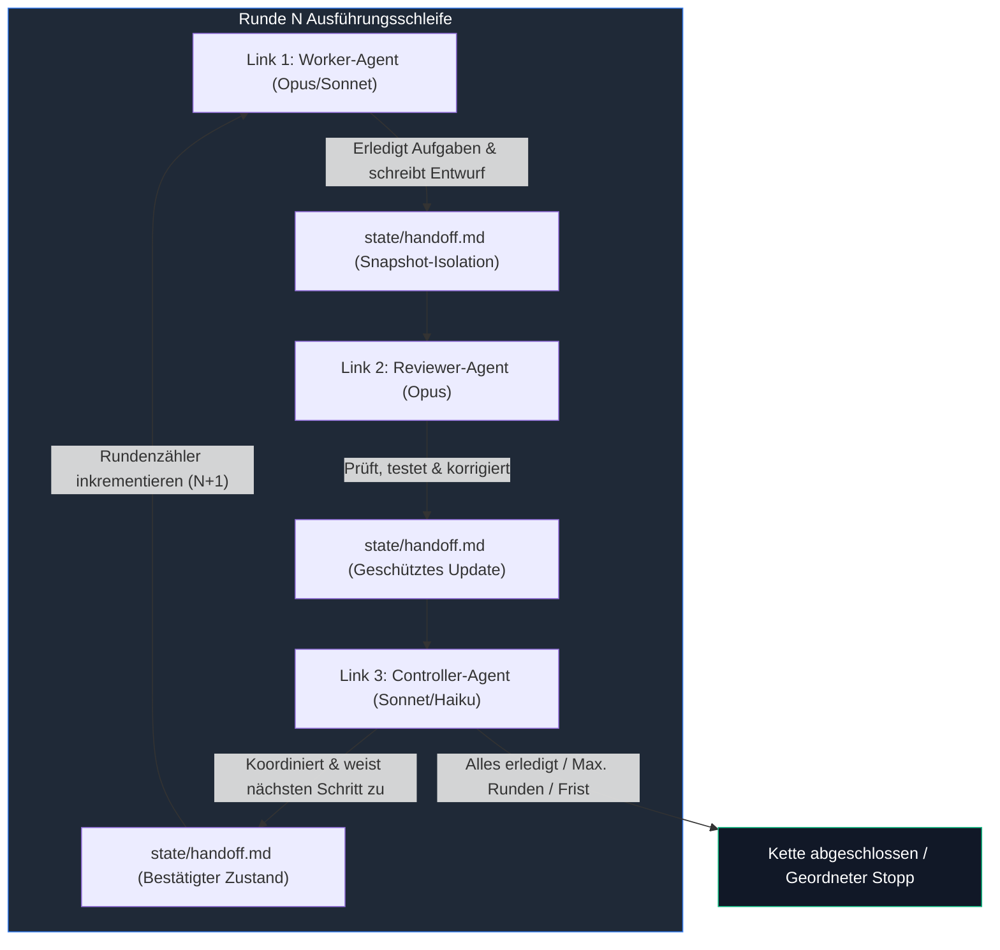
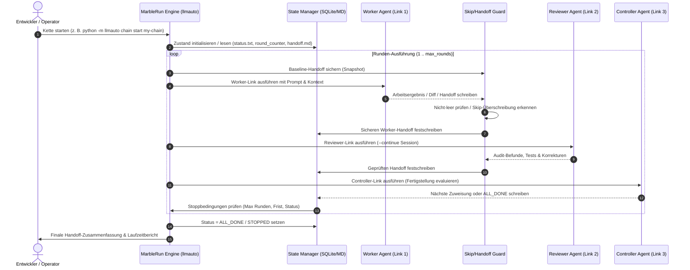

# llmauto -- LLM Automation Framework (MarbleRun)

[English](README.md) | **Deutsch**

*Lokales Multi-Agenten-Orchestrierungs- & Chain-Execution-Framework von [ellmos-ai](https://github.com/ellmos-ai).*

Universelles Automatisierungstool für autonome LLM-Agenten-Ketten ("Marble Runs" / Kugelbahnen). Sequentielle Agentenschleifen, Prompt-Management, Zustandspersistenz und unbeaufsichtigte Arbeitszyklen.

**Kanonischer Suchname:** `ellmos MarbleRun` oder `llmauto`.
Dieses Repository ist nicht das Confidential-Computing-Projekt `edgelesssys/marblerun` und kein Kugelbahn-Spielbaukasten, sondern ein Python-/Claude-Code-Automatisierungsframework für autonome LLM-Agenten-Ketten.

[](https://github.com/ellmos-ai/MarbleRun)
[](https://github.com/ellmos-ai/MarbleRun/actions/workflows/tests.yml)
[]()
[](https://python.org)
[](https://github.com/ellmos-ai/MarbleRun)
[](https://github.com/astral-sh/ruff)
[](SECURITY.md)
[](SECURITY.md)
[](SECURITY.md)
[](THIRD_PARTY_LICENSES.md)
[](MARKETING-LOG.txt)
[](LICENSE)
[](https://github.com/ellmos-ai)
[](https://github.com/open-bricks)
[](llms.txt)

---

## Schnellnavigation

- [1. Zusammenfassung & Kernidentität](#was-ist-llmauto)
- [2. Visuelle Galerie & Systemarchitektur](#visuelle-galerie--systemarchitektur)
- [3. Taktischer Rundenablauf & Sequenzdiagramm](#taktischer-rundenablauf--sequenzdiagramm)
- [4. Zielgruppen & Discoverability-Suchanfragen](#zielgruppen--discoverability-suchanfragen)
- [5. Vergleichsmatrix vs. Alternativen](#vergleichsmatrix--alternativen)
- [6. Governance- & Laufzeit-Invariantenmatrix](#governance--laufzeit-invariantenmatrix)
- [7. Chain-Muster & Rollenmatrix](#chain-muster--rollenmatrix)
- [8. Installation & Voraussetzungen](#installation--voraussetzungen)
- [9. Schritt-für-Schritt Schnellstart](#schritt-fuer-schritt-schnellstart)
- [10. Pipe-Modus & Ad-hoc-Ausführung](#pipe-modus--ad-hoc-ausfuehrung)
- [11. CLI-Referenz & Globale Konfiguration](#cli-referenz--globale-konfiguration)
- [12. Geschwister-Tools & Ökosystemmatrix](#geschwister-tools--oekosystemmatrix)
- [13. Drittanbieter-Lizenzen & Level 1 SBOM](#drittanbieter-lizenzen--transparenz)
- [14. Sicherheitsrichtlinie & Betriebsgrenzen](#sicherheitsrichtlinie--betriebsgrenzen)
- [15. Repository-Struktur & Kernkomponenten](#repository-struktur--kernkomponenten)
- [16. Entwicklung, Testmatrix & Verifikation](#entwicklung--testmatrix)
- [17. Discovery-Kontext & Disambiguierung](#discovery-kontext--suchphrasen)
- [18. Gesetzlicher Haftungsausschluss, Schenkungsklausel (§ 521 BGB) & Lizenz](#haftungsausschluss--lizenz)

> [!NOTE]
> **Für KI-Agenten & automatisierte Tools:** Eine maschinenlesbare Architektur-Zusammenfassung, Suchanker und Integrationshinweise befinden sich in [`llms.txt`](llms.txt).

**Autor:** Lukas Geiger | **Lizenz:** MIT | **Python:** 3.10+ | **Status:** Produktionsreif

---

<a id="was-ist-llmauto"></a>
## 1. Zusammenfassung & Kernidentität

llmauto orchestriert autonome LLM-Agenten-Ketten ("Marble Runs" / Kugelbahnen). Mehrere Agenten arbeiten sequentiell -- Worker erledigen Aufgaben, Reviewer prüfen Ergebnisse, Controller koordinieren -- und übergeben Kontext deterministisch über Handoff-Dateien.

Die Provider-Auswahl erfolgt pro Chain-Link. Claude ist die Standardeinstellung; Codex und Agy laufen über die gemeinsame COMA-Adapterschicht, während Kimi fail-closed bleibt, bis Modell und Login explizit konfiguriert sind:

```json
{
  "name": "reviewer",
  "role": "reviewer",
  "backend": "codex",
  "model": "gpt-5.6-sol",
  "prompt": "prompts/example_reviewer.txt"
}
```

Die optionale Provider-Bridge wird via `pip install -e ".[providers]"` installiert.

Metapher der Kugelbahn: Die Kugel (der Kontext) rollt von Link zu Link in einer Schleife. Jeder Link ist ein spezialisierter LLM-Agent mit eigener Rolle und eigenem Prompt.

### Hauptmerkmale

- **Chain-Ausführung:** Definition von Multi-Agenten-Ketten in JSON, autonome Ausführung über Stunden
- **Marble-Run-Muster:** Sequentielle Agentenschleifen mit Handoff-basierter Kontextübergabe
- **Multi-Modell-Unterstützung:** Kombination von Claude Opus, Sonnet und Haiku in einer einzigen Kette
- **Rollensystem:** Worker, Reviewer, Controller mit Skip-if-not-assigned-Mustern
- **Zustandsverwaltung:** Persistente Rundenzähler, Handoff-Dateien, Stop-/Resume-Unterstützung
- **Pipe-Modus:** Direkte LLM-Einzelaufrufe aus der Kommandozeile
- **Hintergrundausführung:** Start von Ketten in separaten Terminalfenstern
- **Telegram-Benachrichtigungen:** Optionale Status- und Abschlussmeldungen per Telegram-Bot
- **Zero Dependencies:** Reine Python-Standardbibliothek (`subprocess`, `json`, `pathlib`, `sqlite3`)

### Voraussetzungen

- Python 3.10+
- [Claude Code CLI](https://docs.anthropic.com/en/docs/claude-code) (`claude`-Befehl im PATH verfügbar)

---

<a id="visuelle-galerie--systemarchitektur"></a><a id="visuelle-galerie--ausfuehrungsfluss"></a>
## 2. Visuelle Galerie & Systemarchitektur

Die Kernarchitektur folgt einer zyklischen Kugelbahn-Pipeline, in der jeder Agent einen autonomen Schritt mit verifiziertem Zwischenzustand ausführt:



---

<a id="taktischer-rundenablauf--sequenzdiagramm"></a>
## 3. Taktischer Rundenablauf & Sequenzdiagramm

Der Ausführungszyklus koordiniert Prozessisolation, Baseline-Snapshots, Überschreibschutz und persistente Zustandsübergänge:



---

<a id="zielgruppen--discoverability-suchanfragen"></a><a id="zielgruppen"></a>
## 4. Zielgruppen & Discoverability-Suchanfragen

| Persona ID | Zielgruppe | Primäre Anforderungen & Herausforderungen | High-Intent Suchanfragen |
| :--- | :--- | :--- | :--- |
| `[PERSONA-01]` | **Autonome KI-Agenten-Entwickler & Chain-Architekten** | Benötigen unbeaufsichtigte, zyklische Multi-Agenten-Ausführungsschleifen, in denen Worker, Reviewer und Controller stundenlang ohne manuelle Prompt-Eingabe zusammenarbeiten. | `claude code agent chain runner`, `llmauto claude automatisierung`, `unbeaufsichtigte multi agent schleife python`, `autonomer coding agent runner` |
| `[PERSONA-02]` | **Multi-Agenten-Schwarm- & Handoff-Ingenieure** | Benötigen deterministische Kontextübergaben zwischen heterogenen Modellen (z. B. Sonnet Worker, Opus Reviewer, Haiku Controller) mit Skip-Schutz und Baseline-Rollback. | `llm handoff datei muster python`, `worker reviewer controller multi agent schleife`, `skip ueberschreibschutz llm kontext`, `stateless agent handoff` |
| `[PERSONA-03]` | **Enterprise Tooling-, Compliance- & Governance-Beauftragte** | Erfordern 100% lokale, offlinefähige Ausführung (`Zero-Egress`), privilegienfreie Benutzerausführung (`RunAsInvoker`), permissive Open-Source-Lizenzen und duale Sicherheits-SLAs. | `lokale ki agenten orchestrierung zero egress`, `runasinvoker llm automations framework`, `enterprise agenten ketten python`, `permissive lizenz ai agent runner` |
| `[PERSONA-04]` | **Open-Source Tool-Entwickler & Local-First-Programmierer** | Wünschen schlanke, abhängigkeitsfreie Python-Werkzeuge, die lokale LLM-CLIs direkt über Standardbibliothek-Primitiven ohne schwere Frameworks ansteuern. | `zero dependency llm orchestrierung python`, `claude cli wrapper python stdlib`, `schlankes agent chain framework`, `kugelbahn ki agenten schleife` |

---

<a id="vergleichsmatrix--alternativen"></a><a id="siehe-auch-openclaw"></a>
## 5. Vergleichsmatrix vs. Alternativen

| Architekturdimension | `MarbleRun (llmauto)` | LangGraph / LangChain | CrewAI | AutoGen (Microsoft) | Invarianten-Bezug |
| :--- | :--- | :--- | :--- | :--- | :--- |
| **Laufzeit-Abhängigkeiten** | **Null** (100% Python-Standardbibliothek) | Sehr hoch (hunderte Pip-Pakete) | Sehr hoch (Pydantic, LangChain Stack) | Moderat bis hoch | `INV-LOCAL-01` |
| **Privilegienmodell** | `RunAsInvoker` (reiner unprivilegierter User-Mode) | Skriptkontext ohne Privilegien-Check | Prozessausführung mit loser Isolation | Container- und Docker-Fokus | `INV-SEC-02` |
| **Backend-Isolation** | Multi-Provider Fail-Closed (Claude, Codex, Agy) | Dynamischer Provider-Wechsel mit Fallbacks | Provider-Abstraktion mit variabler Prüfung | Multi-Provider mit komplexer Konfiguration | `INV-GATE-03` |
| **Nebenläufigkeit & Worker** | Rennfreie isolierte Worker-Arbeitsbereiche | Thread- / Async-Task-Pool | Asynchrone Tasks mit geteiltem State | Konversations-Threads & Event-Loops | `INV-SYNC-04` |
| **Kontext-Hungerschutz** | Skip-Erkennung & automatischer Rollback | Nicht vorhanden (wird überschrieben) | Wiederholungsversuche bei Fehlern | Konversations-Rundenerholung | `INV-CONT-05` |
| **Zustandspersistenz** | Transparente Text- & Markdown-Dateien | SQLite- / Postgres-Checkpointer | In-Memory oder proprietäres SQLite | In-Memory oder Cache-Datenbanken | `INV-STATE-06` |
| **Prozessaufruf-Sicherheit** | Direkter Vektoraufruf (`shell=False`) | Shell-Tools häufig aktiviert | Python-Ausführungswerkzeuge verfügbar | Code-Ausführungsumgebung | `INV-PROC-07` |
| **Multi-OS CI-Matrix** | Linux, Windows, macOS (Python 3.10-3.13) | Standard CI-Matrix | Standard CI-Matrix | Multi-OS CI-Matrix | `INV-CI-08` |
| **CI Concurrency-Gate** | Strikter `cancel-in-progress` Gate | Standard Workflow-Trigger | Standard Workflow-Trigger | Concurrency Controls | `INV-CONC-09` |
| **Sicherheitsgovernance** | Formales 48h-SLA & Advisory-Prozess | Allgemeines Open-Source Issue-Tracking | Kommerzielles Startup-SLA | Enterprise-Sicherheitsmeldungen | `INV-SLA-10` |

### Architektur-Spotlight: MarbleRun vs. OpenClaw

MarbleRun bringt LLMs zum Handeln -- autonome Multi-Agenten-Ketten, in denen Worker, Reviewer und Controller in Schleifen zusammenarbeiten. Wie schneidet es im Vergleich zu [OpenClaw](https://github.com/openclaw/openclaw) ab?

| Dimension | **MarbleRun (llmauto)** | **OpenClaw** |
|---|---|---|
| **Fokus** | Autonome Multi-Agenten-Orchestrierung -- LLMs handeln lassen | Persönlicher KI-Assistent -- Konversations-Gateway |
| **Ausführung** | Multi-Agenten-Ketten: Worker -> Reviewer -> Controller Schleifen | Einzelagent reagiert auf Benutzereingaben |
| **Autonomie** | Vollständig autonom -- Ketten laufen stundenlang unbeaufsichtigt | Reaktiv -- antwortet auf Nutzereingaben, Cron/Webhooks |
| **Multi-Modell** | Opus, Sonnet, Haiku in einer Kette nach Rollen gemischt | Modellauswahl pro Sitzung, Failover-Support |
| **Zustand** | Handoff-Dateien, Rundenzähler, persistente Sitzungen (`continue`) | Sitzungsverlauf mit `/compact`-Zusammenfassung |
| **Abhängigkeiten** | Null -- reine Python-Standardbibliothek + Claude Code CLI | Node.js 22+, zahlreiche npm-Pakete |
| **Lizenz** | MIT | MIT |

**Kurz gesagt:** OpenClaw verbindet LLMs mit Konversationen. MarbleRun verbindet LLMs miteinander -- und schafft autonome Arbeitsschleifen, in denen Agenten ohne menschliches Eingreifen kollaborieren, prüfen und iterieren.

---

<a id="governance--laufzeit-invariantenmatrix"></a><a id="kernfaehigkeiten--sicherheitsinvarianten"></a>
## 6. Governance- & Laufzeit-Invariantenmatrix

MarbleRun basiert auf strikten Local-First-, Zero-Egress- und Resilienz-Garantien:

| Invarianten-ID & Fähigkeit | Implementierungsmechanismus | Sicherheits- & Zuverlässigkeitsgarantie |
|---|---|---|
| **INV-LOCAL-01: 100% Offline / Zero-Egress** | Lokale CLI-Orchestrierung via `subprocess` ohne externe Netzwerk-Listener | Null Datenabfluss; Prompt- und Modellkontexte verbleiben auf dem lokalen Host |
| **INV-SEC-02: Privilegienfreie Ausführung (`RunAsInvoker`)** | Standardmäßige Python-Ausführung ohne Root-/Administrator-Rechte | Verhindert Systemmanipulation; sichere sandboxed CLI-Ausführung |
| **INV-GATE-03: Multi-Provider Fail-Closed** | Strikte Backend-Validierung (Claude CLI, optionaler COMA-Adapter für Codex/Agy) | Unkonfigurierte Backends brechen fail-closed ab; kein unsicheres Fallback |
| **INV-SYNC-04: Race-Free Parallel-Worker** | Isolierte Handoff-Snapshots je Worker (`tests/test_parallel_handoff.py`) | Verhindert Race Conditions beim simultanen Schreiben paralleler Agenten |
| **INV-CONT-05: Skip-Überschreibschutz** | Automatische Wiederherstellung der Baseline bei leeren `SKIPPED`-Antworten | Verhindert Kontextverlust; bewahrt wertvollen vorgelagerten Kontext |
| **INV-STATE-06: Persistente Zustandsmaschine** | Transparente Dateisystem-Artefakte (`status.txt`, `round_counter.txt`, `handoff.md`) | Neustartfest; kein proprietärer Binär-Lock-in; menschlich lesbar |
| **INV-PROC-07: Sicheres Prozess-Scoping** | Direkte `argv`-Ausführung (`shell=False`) mit bereinigten Umgebungsvariablen | Schließt Shell-Injektionen und unkontrollierte Nebeneffekte aus |
| **INV-CI-08: Multi-OS CI-Matrix** | Automatisierte GitHub Actions Tests unter Ubuntu, Windows und macOS | Garantierte Plattformneutralität unter Python 3.10, 3.11, 3.12 und 3.13 |
| **INV-CONC-09: Strikter Concurrency-Gate** | CI-Workflow mit `concurrency: cancel-in-progress: true` | Verhindert veraltete CI-Läufe und Ressourcenverschwendung |
| **INV-SLA-10: Kryptographische Auditierbarkeit & SLA** | Zeitgestempelte Übergänge, 48h-Reaktionszusage und deterministische Tests | Manipulationssicheres Audit, garantierte Triage binnen 5 Werktagen |

---

<a id="chain-muster--rollenmatrix"></a>
## 7. Chain-Muster & Rollenmatrix

| Rolle | Primäre Verantwortung | Empfohlenes Modell | Kontext-Retention |
|---|---|---|---|
| `worker` | Implementiert Features, Fehlerbehebungen, Refactorings | `claude-sonnet-4-6` | Frische Sitzung pro Runde oder isolierter Handoff |
| `reviewer` | Prüft Codequalität, führt Test-Suites aus, findet Regressionen | `claude-opus-4-6` | `continue: true` für persistenten Projektkontext |
| `controller` | Bewertet Meilenstein-Fortschritt, steuert Tasks, leitet Stopp ein | `claude-sonnet-4-6` / `haiku` | Bewertet Kriterien gegen `max_rounds` & Frist |

### Stoppbedingungen

Eine Kette stoppt automatisch, wenn mindestens eine der folgenden Bedingungen zutrifft:

- `runtime_hours` überschritten
- `max_rounds` erreicht
- `status.txt` enthält "STOPPED" oder "ALL_DONE"
- `max_consecutive_blocks` aufeinanderfolgende BLOCK-Zustände
- Manuelles Anhalten via `llmauto chain stop`

### Zustandsdateien

Jede Kette verwaltet persistenten Zustand unter `state/<chain-name>/`:

| Datei | Zweck |
|---|---|
| `status.txt` | READY, RUNNING, STOPPED, ALL_DONE, BLOCKED |
| `round_counter.txt` | Aktuelle Rundennummer |
| `handoff.md` | Kontext-Handoff zwischen Links |
| `start_time.txt` | Startzeitstempel der Kette |

### Chain-Konfigurationsschema

| Feld | Typ | Beschreibung |
|---|---|---|
| `description` | string | Menschenlesbare Beschreibung |
| `mode` | string | `loop` (Wiederholung), `once` (Einzellauf), `deadend` (Einzellauf) |
| `max_rounds` | int | Maximale Anzahl kompletter Rundenzyklen |
| `runtime_hours` | float | Maximale Gesamtlaufzeit in Stunden |
| `deadline` | string | Feste Frist (ISO-Datum) |
| `defaults` | object | Kettenweite Runner-Vorgaben für Permissions, Tools, Timeout, Environment |
| `links` | array | Geordnete Liste der Chain-Links |

### Link-Konfiguration

| Feld | Typ | Beschreibung |
|---|---|---|
| `name` | string | Eindeutiger Link-Bezeichner |
| `role` | string | `worker`, `reviewer`, `controller` |
| `model` | string | Claude-Modell-ID |
| `prompt` | string | Prompt-Vorlagendatei oder Inline-Text |
| `continue` | bool | `--continue`-Flag nutzen (persistente Session) |
| `fallback_model` | string | Fallback-Modell bei Primärausfall |
| `until_full` | bool | Kontextlimit-Awareness-Suffix anhängen |
| `telegram_update` | bool | Telegram-Benachrichtigung nach Link-Abschluss |
| `permission_mode` | string | Optionaler Override des Permission-Modus |
| `allowed_tools` | array | Optionale Tool-Erlaubnisliste pro Link |
| `timeout_seconds` | int | Maximaler Ausführungs-Timeout pro Link |
| `env` | object | Optionale Umgebungsvariablen pro Link |

Runner-Einstellungen lösen konsistent in dieser Reihenfolge auf: Link-Override, Chain-`defaults`, globale `config.json`.

---

<a id="installation--voraussetzungen"></a><a id="installation"></a>
## 8. Installation & Voraussetzungen

```bash
git clone https://github.com/ellmos-ai/MarbleRun.git
cd MarbleRun

# Direkt ausführen (ohne Installation, reine Standardbibliothek)
python -m llmauto --help

# Oder als editierbares Paket installieren
pip install -e .
llmauto --help

# Optional: Provider-Bridge für Codex / Agy Backends
pip install -e ".[providers]"
```

---

<a id="schritt-fuer-schritt-schnellstart"></a><a id="1-chain-definieren"></a>
## 9. Schritt-für-Schritt Schnellstart

### 1. Chain definieren

Erstelle eine JSON-Datei in `chains/` (z. B. `chains/my-chain.json`):

```json
{
  "description": "Einfache Worker-Reviewer-Schleife",
  "mode": "loop",
  "max_rounds": 5,
  "runtime_hours": 2,
  "links": [
    {
      "name": "worker",
      "role": "worker",
      "model": "claude-sonnet-4-6",
      "prompt": "worker_prompt.txt"
    },
    {
      "name": "reviewer",
      "role": "reviewer",
      "model": "claude-opus-4-6-20250918",
      "prompt": "reviewer_prompt.txt",
      "continue": true
    }
  ]
}
```

### 2. Prompt-Vorlagen erstellen

Lege Prompt-Dateien in `prompts/` ab (z. B. `prompts/worker_prompt.txt`):

```text
Du bist ein Software-Entwicklungs-Worker. Lies die Handoff-Datei unter
state/my-chain/handoff.md für deine aktuelle Aufgabe.

Erledige die zugewiesenen Aufgaben und schreibe ein Handoff für den Reviewer:
- Was wurde abgeschlossen
- Was muss überprüft werden
- Eventuelle Blocker
```

### 3. Kette starten

```bash
# Im Vordergrund starten
python -m llmauto chain start my-chain

# Im Hintergrund starten (neues Terminalfenster)
python -m llmauto chain start my-chain --bg

# Status prüfen
python -m llmauto chain status my-chain

# Geordnet stoppen (nach dem aktuellen Link)
python -m llmauto chain stop my-chain "Grund für den Stopp"

# Logs ansehen
python -m llmauto chain log my-chain 50

# Zustand zurücksetzen (auf Runde 0)
python -m llmauto chain reset my-chain
```

---

<a id="pipe-modus--ad-hoc-ausfuehrung"></a><a id="4-pipe-mode-einzelaufrufe"></a>
## 10. Pipe-Modus & Ad-hoc-Ausführung

Einzelne LLM-Aufrufe direkt aus dem Terminal oder in Shell-Skripten:

```bash
# Direkter Prompt
python -m llmauto pipe "Erkläre Quantencomputing in 3 Sätzen"

# Aus Datei
python -m llmauto pipe -f prompt.txt

# Mit Modell-Override
python -m llmauto pipe "Hallo" --model claude-opus-4-6-20250918
```

---

<a id="cli-referenz--globale-konfiguration"></a><a id="cli-referenz"></a>
## 11. CLI-Referenz & Globale Konfiguration

### CLI-Befehlsübersicht

| Befehl | Argumente | Beschreibung |
|---|---|---|
| `python -m llmauto chain start <name>` | `[--bg]` | Startet eine Kette im Vordergrund oder im neuen Terminalfenster |
| `python -m llmauto chain status <name>` | | Zeigt aktuelle Runde, Ausführungsstatus und aktiven Link an |
| `python -m llmauto chain stop <name>` | `[grund]` | Stoppt die Kette geordnet nach Abschluss des aktuellen Links |
| `python -m llmauto chain log <name>` | `[zeilen]` | Zeigt die letzten Log-Ausgaben an (Standard: 50 Zeilen) |
| `python -m llmauto chain reset <name>` | | Setzt Rundenzähler und Zustand auf Runde 0 zurück |
| `python -m llmauto chain create` | | Interaktiver CLI-Assistent zur Erstellung neuer Ketten |
| `python -m llmauto pipe <prompt>` | `[-f datei] [--model ID]` | Führt einen einzelnen Prompt direkt über die CLI aus |

### Globale Konfiguration (`config.json`)

| Einstellung | Standard | Beschreibung |
|---|---|---|
| `default_model` | `claude-sonnet-4-6` | Primäres Modell für Links ohne expliziten Override |
| `default_permission_mode` | `dontAsk` | Berechtigungsmodus für unbeaufsichtigte Ausführung |
| `default_allowed_tools` | `Read, Edit, Write, Bash, Glob, Grep` | Erlaubte Claude-Code-Werkzeuge |
| `default_timeout_seconds` | `7200` (2h) | Maximaler Timeout pro Link |
| `telegram.enabled` | `false` | Optionale Statusmeldungen via Telegram |

---

<a id="geschwister-tools--oekosystemmatrix"></a><a id="geschwister-tools--oekosystem"></a>
## 12. Geschwister-Tools & Ökosystemmatrix

MarbleRun ist Teil des modularen Ökosystems von `ellmos-ai`, `dev-bricks`, `file-bricks`, `entertain-and-more` und `open-bricks`:

| Werkzeug | Ökosystem | Zweck |
|---|---|---|
| [COMA](https://github.com/ellmos-ai/coma) | `ellmos-ai` | Multi-Provider LLM CLI Orchestrierungs- und Adapterframework |
| [policy-registry](https://github.com/ellmos-ai/policy-registry) | `ellmos-ai` | Governance-Policy-Engine und signierte Agenten-Delegation |
| [system-explorer](https://github.com/ellmos-ai/system-explorer) | `ellmos-ai` | Multi-Agenten-Systemtopologie-Explorer und Laufzeit-Inspektor |
| [sqlite-transit-sync](https://github.com/ellmos-ai/sqlite-transit-sync) | `ellmos-ai` | Lokale SQLite-Zustandssynchronisation für verteilte Agenten |
| [ellmos-clatcher-mcp](https://github.com/ellmos-ai/ellmos-clatcher-mcp) | `ellmos-ai` | Multi-Agenten Kontext-Caching- und Snapshot-Bridge MCP-Server |
| [automation-master](https://github.com/dev-bricks/automation-master) | `dev-bricks` | Lokale Guthabenreservierung und Hintergrund-Automations-Daemon |
| [DevCenter](https://github.com/dev-bricks/DevCenter) | `dev-bricks` | Multi-Repo Entwickler-Werkbank und Telemetrie-Cockpit |
| [CodeBox](https://github.com/dev-bricks/CodeBox) | `dev-bricks` | Sandboxed Multi-Sprachen Code-Ausführungs-Engine |
| [FileCommander](https://github.com/file-bricks/FileCommander) | `file-bricks` | Leistungsstarke Batch-Dateiverarbeitung und Metadaten-Tools |
| [ProFiler](https://github.com/file-bricks/ProFiler) | `file-bricks` | Dateisystem-Inspektion, Duplikaterkennung und Forensik |
| [CuteStrike](https://github.com/entertain-and-more/CuteStrike) | `entertain-and-more` | Lokales gewaltfreies Arena-Spiel mit autonomen KI-Bots |
| [open-bricks](https://github.com/open-bricks) | `open-bricks` | Dachorganisation und Architekturstandards für offene Tools |

---

<a id="drittanbieter-lizenzen--transparenz"></a>
## 13. Drittanbieter-Lizenzen & Level 1 SBOM

MarbleRun (`llmauto`) besitzt null verpflichtende externe Laufzeit-Abhängigkeiten. Die Kern-Engine basiert vollständig auf der Python-Standardbibliothek ([PSFL-2.0](https://docs.python.org/3/license.html)).

Alle optionalen und Entwicklungs-Tools sind 100% permissiv lizenziert:
- **Kern-Engine:** 100% Python Standard Library ([PSFL-2.0](https://docs.python.org/3/license.html)) -- null externe Pakete zur Laufzeit.
- **Optionale Provider-Bridge:** [`coma`](https://github.com/dev-bricks/coma) ([MIT](https://github.com/dev-bricks/coma/blob/main/LICENSE)) für Codex- und Agy-Adapter.
- **Testing & QA:** [`pytest`](https://github.com/pytest-dev/pytest) (MIT), [`ruff`](https://github.com/astral-sh/ruff) (MIT / Apache-2.0), [`setuptools`](https://github.com/pypa/setuptools) (MIT) und [`setuptools-scm`](https://github.com/pypa/setuptools-scm) (MIT).

Keine Copyleft-, GPL- oder AGPL-Bestandteile. Detaillierte Nachweise und Lizenztexte befinden sich in [THIRD_PARTY_LICENSES.md](THIRD_PARTY_LICENSES.md). Die formale Urheberrechtsnotiz liegt unter [NOTICE](NOTICE).

---

<a id="sicherheitsrichtlinie--betriebsgrenzen"></a>
## 14. Sicherheitsrichtlinie & Betriebsgrenzen

MarbleRun garantiert strikte Local-First-Sicherheitsgrenzen:
- **Zero-Egress Standard:** Reine Standardbibliothek-Ausführung ohne Hintergrund-Netzwerkaufrufe oder Telemetrie.
- **RunAsInvoker Isolation:** Läuft im unprivilegierten Benutzerkontext ohne Administrator-Rechte oder Daemons.
- **Unterstützte Versionen & SLAs:** Version 0.1.x wird aktiv unterstützt mit einem 48h-Erstantwort-SLA und einem 5-Werktage-Triage-Ziel.
- **Sicherheitsmeldungen:** Vertrauliche Meldungen via `security@ellmos.ai`, `security@open-bricks.org` oder über [GitHub Security Advisories](https://github.com/ellmos-ai/MarbleRun/security/advisories/new). Details: [SECURITY.md](SECURITY.md).

---

<a id="repository-struktur--kernkomponenten"></a>
## 15. Repository-Struktur & Kernkomponenten

```
MarbleRun/
├── llmauto/                   # Python-Paket und CLI-Einstiegspunkte
│   ├── llmauto.py             # CLI-Dispatcher (chain, pipe, inspect)
│   ├── core/                  # Engine-Interna
│   │   ├── runner.py          # Claude CLI & Provider-Aufruf (subprocess, env, fallback)
│   │   ├── config.py          # Chain- & Konfigurationsparser (JSON)
│   │   └── state.py           # Handoff-Dateien, Rundenzähler, Shutdown-Trigger
│   └── modes/                 # Ausführungsmodi (Chain Runner, Pipe)
│       └── chain.py           # Zyklische Marble-Run-Engine
├── chains/                    # Beispiel- und Produktions-Chain-Dateien (JSON)
├── prompts/                   # Wiederverwendbare Prompt-Vorlagen pro Rolle
├── templates/                 # Chain-Muster-Blaupausen (worker-reviewer, gui-live-test)
├── tests/                     # Vollständige Vertrags- und Integrationstest-Suite
├── docs/                      # Architekturnotizen & Playtest-Beweismaterial
├── CHANGELOG.md               # Versionierte Änderungshistorie
├── LICENSE                    # MIT-Lizenz
├── NOTICE                     # Produkt- und Urheberrechtsdeklaration
├── THIRD_PARTY_LICENSES.md    # Level 1 SBOM & Lizenz-Audit
├── MARKETING-LOG.txt          # Discoverability-Log & SEO-Suchbegriffe
├── SECURITY.md                # Zweisprachige Sicherheitsrichtlinie & SLAs
├── llms.txt                   # Maschinenlesbarer KI-Agenten-Index
└── pyproject.toml             # PEP 621 Paketmanifest & Ruff-Konfiguration
```

---

<a id="entwicklung--testmatrix"></a>
## 16. Entwicklung, Testmatrix & Verifikation

MarbleRun unterhält eine automatisierte Test-Suite mit 100% grünem Bestehensstatus:

```bash
# Vollständige Test-Suite ausführen
pytest

# Ausführliche Ausgabe mit Zusammenfassung
pytest -ra -v

# Code-Stil- und Linter-Prüfung
ruff check .

# Python-Bytecode im gesamten Repository kompilieren
python -m compileall -q .
```

Die CI-Pipeline läuft automatisch via `.github/workflows/tests.yml` unter:
- **Betriebssysteme:** Ubuntu Latest, Windows Latest, macOS Latest
- **Python-Versionen:** 3.10, 3.11, 3.12 und 3.13
- **Gates:** Ruff-Linter, Compileall-Bytecode-Check, Concurrency Cancel-in-Progress und 15-Minuten-Timeout-Wächter.

---

<a id="discovery-kontext--suchphrasen"></a><a id="beste-suchphrasen"></a>
## 17. Discovery-Kontext & Disambiguierung

Nutze diese Suchphrasen bei der Suche in Suchmaschinen, auf GitHub oder in KI-Tool-Indizes:

| Suchphrase | Bedeutung |
|---|---|
| `ellmos MarbleRun` | Unterscheidet dieses Repo von Confidential-Computing- und Spielprojekten |
| `llmauto Claude Code automation` | Findet den Paket- und CLI-Namen |
| `MarbleRun LLM agent chains` | Beschreibt das zentrale Chain-Ausführungsmuster |
| `local-first multi-agent orchestration Python` | Erfasst den abhängigkeitsfreien lokalen Automations-Use-Case |
| `Claude Code agent chain runner` | Findet unbeaufsichtigte Worker/Reviewer/Controller Schleifen |
| `llmauto autonomous agent loop` | Verbindet CLI-Namen mit dem Automationsmuster |

### Disambiguierungs-Hinweis

MarbleRun wird am zuverlässigsten über seinen Paketnamen `llmauto` und die Kombination mit Claude Code Automatisierung gefunden. Der Name `MarbleRun` allein führt häufig zu Ergebnissen aus dem Bereich Confidential Computing (`edgelesssys/marblerun`) oder physischen Murmelbahnen.

---

<a id="haftungsausschluss--lizenz"></a><a id="lizenz"></a>
## 18. Gesetzlicher Haftungsausschluss, Schenkungsklausel (§ 521 BGB) & Lizenz

### Gesetzlicher Haftungsausschluss (§ 521 BGB Gefälligkeitsrecht)

Dieses Open-Source-Softwareprodukt wird als **unentgeltliche Schenkung** im Sinne der §§ 516 ff. BGB bereitgestellt. Gemäß **§ 521 BGB** ist die Haftung des Urhebers und der Beitragenden auf **Vorsatz und grobe Fahrlässigkeit** beschränkt. Ergänzend gelten die nachstehenden Bestimmungen der MIT-Lizenz.

Nutzung auf eigenes Risiko. Keine Wartungsverpflichtung, keine Verfügbarkeitszusicherung, keine Gewähr für Fehlerfreiheit oder Eignung für einen bestimmten Einsatzzweck.

### Englische Zusammenfassung (English Summary)

This project is an unpaid open-source donation. In accordance with § 521 of the German Civil Code (BGB), liability is restricted strictly to cases of intentional misconduct and gross negligence. Supplemental liability disclaimers are set forth in the MIT License below.

### Lizenz

Veröffentlicht unter den Bedingungen der [MIT-Lizenz](LICENSE).
Copyright (c) 2026 Lukas Geiger. Siehe [LICENSE](LICENSE) und [NOTICE](NOTICE) für alle Einzelheiten.
Drittanbieter-Lizenzen sind in [THIRD_PARTY_LICENSES.md](THIRD_PARTY_LICENSES.md) auditiert.
