# llmauto -- LLM Automation Framework (MarbleRun)

**🇬🇧 [English Version](README.md)**

*Automatisierungs- & Workflow-System von [ellmos-ai](https://github.com/ellmos-ai).*

Universelles Automatisierungstool für LLM-Agenten.
Chain-Ausführung, Prompt-Verwaltung, autonome Arbeitsschleifen.

**Kanonischer Suchname:** `ellmos MarbleRun` oder `llmauto`.
Dieses Repository ist nicht das Confidential-Computing-Projekt
`edgelesssys/marblerun` und kein Marble-Run-Spielbaukasten, sondern ein
Python-/Claude-Code-Automatisierungsframework für autonome LLM-Agenten-Ketten.

**Autor:** Lukas Geiger | **Lizenz:** MIT | **Python:** 3.10+

---

## Was ist llmauto?

llmauto orchestriert autonome LLM-Agenten-Ketten ("Marble Runs" -- Kugelbahnen). Mehrere Agenten arbeiten nacheinander -- Worker führen Aufgaben aus, Reviewer prüfen Ergebnisse, Controller koordinieren -- und reichen den Kontext über Handoff-Dateien weiter.

Stell es dir wie eine Kugelbahn vor: Die Kugel (Kontext) rollt von Glied zu Glied in einer Schleife, wobei jedes Glied ein LLM-Agent mit einer bestimmten Rolle und einem bestimmten Prompt ist.

### Beste Suchphrasen

Diese Begriffe helfen bei Websuche, GitHub-Suche, LLM-Tool-Indexes und interner
Automationsdokumentation:

| Suchphrase | Zweck |
|---|---|
| `ellmos MarbleRun` | Grenzt dieses Repo von Confidential-Computing- und Spielprojekten namens MarbleRun ab |
| `llmauto Claude Code automation` | Findet Paket- und CLI-Namen im Code |
| `MarbleRun LLM agent chains` | Beschreibt das zentrale Chain-Execution-Muster |
| `local-first multi-agent orchestration Python` | Beschreibt den lokalen Zero-Dependency-Automatisierungsfall |
| `Claude Code agent chain runner` | Passt zu Suchen nach unbeaufsichtigten Claude-Code-Worker-/Reviewer-/Controller-Schleifen |
| `llmauto autonomous agent loop` | Verbindet CLI-/Paketnamen mit dem zentralen Automationsmuster |

### Discovery-Kontext

MarbleRun wird am besten über den CLI-/Paketnamen `llmauto` plus Anwendungsfall
gefunden: Claude-Code-Automation, Agent-Chain-Runner, lokale Multi-Agenten-
Orchestrierung und handoff-basierte autonome Arbeitsschleifen. Der reine Name
`MarbleRun` wird bewusst abgegrenzt, weil öffentliche Suchergebnisse auch
Confidential-Computing-Infrastruktur und physische Marble-Run-Projekte zeigen.

### Hauptmerkmale

- **Chain Execution:** Definiere Multi-Agenten-Ketten in JSON und führe sie autonom aus
- **Marble Run Pattern:** Sequentielle Agenten-Schleifen mit kontextbasierter Übergabe via Handoff-Dateien
- **Multi-Model Support:** Mische Claude Opus, Sonnet und Haiku in einer einzigen Chain
- **Rollensystem:** Worker, Reviewer, Controller mit Skip-if-not-assigned-Mustern
- **State Management:** Persistente Rundenzähler, Handoff-Dateien, Stop/Resume-Unterstützung
- **Pipe Mode:** Einzelne LLM-Aufrufe über die Kommandozeile
- **Hintergrundausführung:** Chains in separaten Terminalfenstern starten
- **Telegram-Benachrichtigungen:** Optionale Statusupdates über Telegram Bot
- **Keine Abhängigkeiten:** Reines Python stdlib (subprocess, json, pathlib, sqlite3)

### Voraussetzungen

- Python 3.10+
- [Claude Code CLI](https://docs.anthropic.com/en/docs/claude-code) (`claude`-Befehl muss im PATH verfügbar sein)

---

## Installation

```bash
git clone https://github.com/ellmos-ai/MarbleRun.git
cd MarbleRun

# Direkt ausführen (keine Installation nötig)
python -m llmauto --help

# Oder als Paket installieren
pip install -e .
llmauto --help
```

---

## Schnellstart

### 1. Chain-Definition erstellen

Erstelle eine JSON-Datei in `chains/` (z.B. `chains/my-chain.json`):

```json
{
  "description": "Simple worker-reviewer loop",
  "mode": "loop",
  "max_rounds": 5,
  "runtime_hours": 2,
  "links": [
    {
      "name": "worker",
      "role": "worker",
      "model": "claude-sonnet-4-6",
      "prompt": "worker_prompt.txt"
    },
    {
      "name": "reviewer",
      "role": "reviewer",
      "model": "claude-opus-4-6-20250918",
      "prompt": "reviewer_prompt.txt",
      "continue": true
    }
  ]
}
```

### 2. Prompt-Vorlagen erstellen

Prompt-Dateien in `prompts/` ablegen (z.B. `prompts/worker_prompt.txt`):

```text
You are a software development worker. Read the handoff file at
state/my-chain/handoff.md for your current assignment.

Execute the assigned tasks, then write a handoff for the reviewer:
- What you completed
- What needs review
- Any blockers
```

### 3. Chain ausführen

```bash
# Im Vordergrund starten
python -m llmauto chain start my-chain

# Im Hintergrund starten (öffnet neues Terminalfenster)
python -m llmauto chain start my-chain --bg

# Status prüfen
python -m llmauto chain status my-chain

# Sauber stoppen (nach Abschluss des aktuellen Links)
python -m llmauto chain stop my-chain "Reason for stopping"

# Logs anzeigen
python -m llmauto chain log my-chain 50

# State zurücksetzen (zurück auf Runde 0)
python -m llmauto chain reset my-chain
```

### 4. Pipe Mode (Einzelaufrufe)

```bash
# Direkter Prompt
python -m llmauto pipe "Explain quantum computing in 3 sentences"

# Aus Datei
python -m llmauto pipe -f prompt.txt

# Mit Model-Override
python -m llmauto pipe "Hello" --model claude-opus-4-6-20250918
```

---

## Chain-Architektur

### Wie Marble Runs funktionieren

```
Runde N:
  [Link 1: Worker]  --führt Aufgaben aus-->  schreibt handoff.md
                                              |
  [Link 2: Reviewer] --liest Handoff-->  prüft + korrigiert --> schreibt handoff.md
                                              |
  [Link 3: Controller] --liest Handoff-->  koordiniert --> schreibt handoff.md
                                              |
                                        Runde N+1 ...
```

### Abbruchbedingungen

Eine Chain stoppt, wenn eine der folgenden Bedingungen erfüllt ist:

- `runtime_hours` überschritten
- `max_rounds` erreicht
- `status.txt` enthält "STOPPED" oder "ALL_DONE"
- `max_consecutive_blocks` aufeinanderfolgende BLOCK-Zustände
- Manueller Stopp über `llmauto chain stop`

### State-Dateien

Jede Chain pflegt einen persistenten Zustand in `state/<chain-name>/`:

| Datei | Zweck |
|-------|-------|
| `status.txt` | READY, RUNNING, STOPPED, ALL_DONE, BLOCKED |
| `round_counter.txt` | Aktuelle Rundennummer |
| `handoff.md` | Kontext-Übergabe zwischen Links |
| `start_time.txt` | Startzeitpunkt der Chain |

### Chain-Konfigurationsschema

| Feld | Typ | Beschreibung |
|------|-----|-------------|
| `description` | string | Menschenlesbare Beschreibung |
| `mode` | string | `loop` (wiederholen), `once` (Einzeldurchlauf), `deadend` (Einzeldurchlauf) |
| `max_rounds` | int | Maximale Anzahl vollständiger Zyklen |
| `runtime_hours` | float | Maximale Laufzeit in Stunden |
| `deadline` | string | Feste Deadline (ISO-Datum) |
| `links` | array | Geordnete Liste der Chain-Links |

### Link-Konfiguration

| Feld | Typ | Beschreibung |
|------|-----|-------------|
| `name` | string | Eindeutiger Link-Bezeichner |
| `role` | string | `worker`, `reviewer`, `controller` |
| `model` | string | Claude Model ID |
| `prompt` | string | Prompt-Vorlagenname oder Inline-Text |
| `continue` | bool | `--continue`-Flag verwenden (persistente Session) |
| `fallback_model` | string | Fallback-Model bei Fehler des primären |
| `until_full` | bool | Kontextlimit-Suffix hinzufügen |
| `telegram_update` | bool | Telegram-Benachrichtigung nach diesem Link senden |

---

## Fortgeschrittene Muster

### Skip-If-Not-Assigned

Für Chains, in denen ein Controller Arbeit entweder einem Opus- oder Sonnet-Worker zuweist:

```json
{
  "links": [
    {"name": "controller", "role": "controller", "model": "opus"},
    {"name": "opus-worker", "role": "worker", "model": "opus"},
    {"name": "sonnet-worker", "role": "worker", "model": "sonnet"}
  ]
}
```

Der Controller schreibt `ASSIGNED: opus` oder `ASSIGNED: sonnet` in den Handoff.
Der nicht zugewiesene Worker liest den Handoff und überspringt sofort.

### Continue Mode

Links mit `"continue": true` behalten eine persistente Claude Code Session
in einem eigenen Workspace-Verzeichnis bei. Jeder Aufruf setzt das vorherige
Gespräch fort und bewahrt den vollständigen Kontext.

### Template-Variablen

Prompts unterstützen die Platzhalter `{HOME}` (Windows-Pfad) und `{BASH_HOME}` (Unix-Pfad),
die zur Laufzeit aufgelöst werden.

---

## Projektstruktur

```
llmauto/
  llmauto.py              Haupt-CLI-Einstiegspunkt
  config.json             Globale Konfiguration
  core/
    runner.py             Claude CLI Wrapper (subprocess, env, fallback)
    config.py             Konfigurationsverwaltung (Chains, global)
    state.py              State Management (Handoff, Runden, Abbruch)
  modes/
    chain.py              Marble Run Engine
  chains/                 Chain-Definitionen (JSON)
  prompts/                Prompt-Vorlagen pro Chain
  state/                  Laufzeit-State pro Chain (gitignored)
  logs/                   Laufzeit-Logs (gitignored)
  templates/              Chain-Muster-Vorlagen
  docs/                   Dokumentation
```

---

## Globale Konfiguration (config.json)

| Einstellung | Standard |
|-------------|----------|
| `default_model` | `claude-sonnet-4-6` |
| `default_permission_mode` | `dontAsk` |
| `default_allowed_tools` | Read, Edit, Write, Bash, Glob, Grep |
| `default_timeout_seconds` | 7200 (2 Std.) |
| `telegram.enabled` | false |

---

## Enthaltene Beispiel-Chains

llmauto wird mit mehreren produktionserprobten Chain-Konfigurationen ausgeliefert:

| Chain | Muster | Beschreibung |
|-------|--------|-------------|
| `worker-reviewer-loop` | Vorlage | Einfaches 2-Link Worker/Reviewer-Muster |

Siehe `chains/` für die vollständige Liste der enthaltenen Chain-Definitionen.

---

## Siehe auch: OpenClaw

MarbleRun bringt LLMs zum Handeln -- autonome Multi-Agenten-Ketten, in denen Worker, Reviewer und Controller in Schleifen zusammenarbeiten. Wie steht es im Vergleich zu [OpenClaw](https://github.com/openclaw/openclaw)?

| | **MarbleRun** | **OpenClaw** |
|---|---|---|
| **Fokus** | Autonome Multi-Agenten-Orchestrierung -- LLMs zum Handeln bringen | Persönlicher KI-Assistent -- konversationelles Gateway |
| **Ausführung** | Multi-Agenten-Ketten: Worker -> Reviewer -> Controller Schleifen | Einzel-Agent, der auf Nachrichten reagiert |
| **Autonomie** | Vollständig autonom -- Chains laufen stundenlang unbeaufsichtigt (Runden, Deadlines, Abbruchbedingungen) | Reaktiv -- antwortet auf Benutzereingaben, Cron/Webhooks für Automatisierung |
| **Multi-Model** | Mische Opus, Sonnet, Haiku in einer Chain mit rollenbasierter Zuweisung | Modellauswahl pro Session, Failover-Unterstützung |
| **State** | Handoff-Dateien, Rundenzähler, persistente Sessions (`continue` Mode) | Session-History mit `/compact`-Zusammenfassung |
| **Abhängigkeiten** | Keine -- reines Python stdlib + Claude Code CLI | Node.js 22+, zahlreiche npm-Pakete |
| **Lizenz** | MIT | MIT |

**Kurzfassung:** OpenClaw verbindet LLMs mit Konversationen. MarbleRun verbindet LLMs miteinander -- und erschafft autonome Arbeitsschleifen, in denen Agenten zusammenarbeiten, prüfen und iterieren, ohne menschliches Eingreifen.

## Lizenz

MIT-Lizenz. Siehe [LICENSE](LICENSE).

---

## Autor

Lukas Geiger -- [github.com/lukisch](https://github.com/lukisch)
