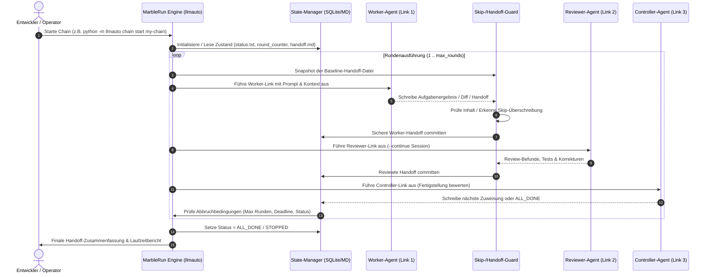

# llmauto -- LLM Automation Framework (MarbleRun)

**🇬🇧 [English Version](README.md)**

*Lokales Multi-Agenten-Orchestrierungs- & Chain-Execution-Framework von [ellmos-ai](https://github.com/ellmos-ai).*

Universelles Automatisierungstool für autonome LLM-Agenten-Ketten ("Marble Runs" / Kugelbahnen).
Sequentielle Agentenschleifen, Prompt-Management, Zustandspersistenz und unbeaufsichtigte Arbeitszyklen.

**Kanonischer Suchname:** `ellmos MarbleRun` oder `llmauto`.
Dieses Repository ist nicht das Confidential-Computing-Projekt
`edgelesssys/marblerun` und kein Marble-Run-Spielbaukasten, sondern ein
Python-/Claude-Code-Automatisierungsframework für autonome LLM-Agenten-Ketten.

[](https://github.com/ellmos-ai/MarbleRun)
[](https://github.com/ellmos-ai/MarbleRun/actions/workflows/tests.yml)
[]()
[]()
[]()
[]()
[](SECURITY.md)
[](LICENSE)
[](https://github.com/ellmos-ai)
[](https://github.com/open-bricks)
[](llms.txt)

> [!NOTE]
> **Für KI-Agenten & automatisierte Tools:** Eine maschinenlesbare Architektur-Zusammenfassung, Suchanker und Integrationshinweise befinden sich in [`llms.txt`](llms.txt).

**Autor:** Lukas Geiger | **Lizenz:** MIT | **Python:** 3.10+ | **Navigation:** [Übersicht](#was-ist-llmauto) • [Schnellstart](#schnellstart) • [Visuelle Galerie](#visuelle-galerie--ausfuehrungsfluss) • [Sequenzablauf](#taktischer-rundenablauf--sequenzdiagramm) • [Kernfähigkeiten & Sicherheit](#kernfaehigkeiten--sicherheitsinvarianten) • [Chain-Muster & Rollen](#chain-muster--rollenmatrix) • [CLI-Referenz](#cli-referenz) • [Suchphrasen](#beste-suchphrasen) • [Vergleich](#siehe-auch-openclaw) • [Geschwister-Ökosystem](#geschwister-tools--oekosystem) • [Sicherheitsrichtlinie](SECURITY.md) • [Haftung](#haftung)


---

## Was ist llmauto?

llmauto orchestriert autonome LLM-Agenten-Ketten ("Marble Runs" -- Kugelbahnen). Mehrere Agenten arbeiten nacheinander -- Worker führen Aufgaben aus, Reviewer prüfen Ergebnisse, Controller koordinieren -- und reichen den Kontext über Handoff-Dateien weiter.

Die Provider-Auswahl erfolgt pro Chain-Link. Claude bleibt der Standard; Codex
und Agy laufen über die gemeinsame COMA-Adapterschicht, während Kimi
fail-closed bleibt, bis Modell und Login konfiguriert sind:

```json
{
  "name": "reviewer",
  "role": "reviewer",
  "backend": "codex",
  "model": "gpt-5.6-sol",
  "prompt": "prompts/example_reviewer.txt"
}
```

Die optionale Provider-Bridge wird mit `pip install -e ".[providers]"`
installiert.

Stell es dir wie eine Kugelbahn vor: Die Kugel (Kontext) rollt von Glied zu Glied in einer Schleife, wobei jedes Glied ein LLM-Agent mit einer bestimmten Rolle und einem bestimmten Prompt ist.

### Beste Suchphrasen

Diese Begriffe helfen bei Websuche, GitHub-Suche, LLM-Tool-Indexes und interner
Automationsdokumentation:

| Suchphrase | Zweck |
|---|---|
| `ellmos MarbleRun` | Grenzt dieses Repo von Confidential-Computing- und Spielprojekten namens MarbleRun ab |
| `llmauto Claude Code automation` | Findet Paket- und CLI-Namen im Code |
| `MarbleRun LLM agent chains` | Beschreibt das zentrale Chain-Execution-Muster |
| `local-first multi-agent orchestration Python` | Beschreibt den lokalen Zero-Dependency-Automatisierungsfall |
| `Claude Code agent chain runner` | Passt zu Suchen nach unbeaufsichtigten Claude-Code-Worker-/Reviewer-/Controller-Schleifen |
| `llmauto autonomous agent loop` | Verbindet CLI-/Paketnamen mit dem zentralen Automationsmuster |

### Discovery-Kontext

MarbleRun wird am besten über den CLI-/Paketnamen `llmauto` plus Anwendungsfall
gefunden: Claude-Code-Automation, Agent-Chain-Runner, lokale Multi-Agenten-
Orchestrierung und handoff-basierte autonome Arbeitsschleifen. Der reine Name
`MarbleRun` wird bewusst abgegrenzt, weil öffentliche Suchergebnisse auch
Confidential-Computing-Infrastruktur und physische Marble-Run-Projekte zeigen.

### Hauptmerkmale

- **Chain Execution:** Definiere Multi-Agenten-Ketten in JSON und führe sie autonom aus
- **Marble Run Pattern:** Sequentielle Agenten-Schleifen mit kontextbasierter Übergabe via Handoff-Dateien
- **Multi-Model Support:** Mische Claude Opus, Sonnet und Haiku in einer einzigen Chain
- **Rollensystem:** Worker, Reviewer, Controller mit Skip-if-not-assigned-Mustern
- **State Management:** Persistente Rundenzähler, Handoff-Dateien, Stop/Resume-Unterstützung
- **Pipe Mode:** Einzelne LLM-Aufrufe über die Kommandozeile
- **Hintergrundausführung:** Chains in separaten Terminalfenstern starten
- **Telegram-Benachrichtigungen:** Optionale Statusupdates über Telegram Bot
- **Keine Abhängigkeiten:** Reines Python stdlib (subprocess, json, pathlib, sqlite3)

### Voraussetzungen

- Python 3.10+
- [Claude Code CLI](https://docs.anthropic.com/en/docs/claude-code) (`claude`-Befehl muss im PATH verfügbar sein)

---

## Installation

```bash
git clone https://github.com/ellmos-ai/MarbleRun.git
cd MarbleRun

# Run directly (no install needed)
python -m llmauto --help

# Or install as package
pip install -e .
llmauto --help
```

---

## Schnellstart

### 1. Chain-Definition erstellen

Erstelle eine JSON-Datei in `chains/` (z.B. `chains/my-chain.json`):

```json
{
  "description": "Simple worker-reviewer loop",
  "mode": "loop",
  "max_rounds": 5,
  "runtime_hours": 2,
  "links": [
    {
      "name": "worker",
      "role": "worker",
      "model": "claude-sonnet-4-6",
      "prompt": "worker_prompt.txt"
    },
    {
      "name": "reviewer",
      "role": "reviewer",
      "model": "claude-opus-4-6-20250918",
      "prompt": "reviewer_prompt.txt",
      "continue": true
    }
  ]
}
```

### 2. Prompt-Vorlagen erstellen

Prompt-Dateien in `prompts/` ablegen (z.B. `prompts/worker_prompt.txt`):

```text
You are a software development worker. Read the handoff file at
state/my-chain/handoff.md for your current assignment.

Execute the assigned tasks, then write a handoff for the reviewer:
- What you completed
- What needs review
- Any blockers
```

### 3. Chain ausführen

```bash
# Start in foreground
python -m llmauto chain start my-chain

# Start in background (opens new terminal window)
python -m llmauto chain start my-chain --bg

# Check status
python -m llmauto chain status my-chain

# Stop gracefully (after current link finishes)
python -m llmauto chain stop my-chain "Reason for stopping"

# View logs
python -m llmauto chain log my-chain 50

# Reset state (back to round 0)
python -m llmauto chain reset my-chain
```

### 4. Pipe Mode (Einzelaufrufe)

```bash
# Direct prompt
python -m llmauto pipe "Explain quantum computing in 3 sentences"

# From file
python -m llmauto pipe -f prompt.txt

# With model override
python -m llmauto pipe "Hello" --model claude-opus-4-6-20250918
```

---

## Visuelle Galerie & Ausführungsfluss

Die Kernarchitektur folgt einer zyklischen Kugelbahn-Pipeline, bei der jeder Agent einen autonomen Schritt ausführt und verifizierten Zustand weiterreicht:


---

## Taktischer Rundenablauf & Sequenzdiagramm

Der Ausführungszyklus koordiniert Prozessisolation, Baseline-Snapshotting, Überschreibschutz und persistente Zustandsübergänge:



---

## Kernfähigkeiten & Sicherheitsinvarianten

MarbleRun basiert auf strikten Local-First-, Zero-Egress- und Ausfallsicherheitsgarantien:

| Fähigkeit / Invariante | Implementierungsmechanismus | Sicherheits- & Zuverlässigkeitsgarantie |
|---|---|---|
| **100% Offline / Zero-Egress** | Lokale CLI-Orchestrierung via `subprocess` ohne externe Netzwerk-Listener | Zero Data Egress; Agentenkontext und Prompts verbleiben vollständig lokal |
| **Privilegienfreie Ausführung** | Standard-Python-Laufzeit ohne Administrator-/Root-Rechte (User-Mode) | Verhindert unberechtigte Systemänderungen; sichere Sandboxed-CLI-Ausführung |
| **Multi-Provider Fail-Closed** | Strikte Backend-Auswahl (Claude CLI, optional COMA-Adapter für Codex/Agy) | Unkonfigurierte Backends schlagen fehlgeschlossen fehl; kein stiller unsicherer Fallback |
| **Race-Free Parallel-Worker** | Isolierte Handoff-Snapshots pro Worker (`tests/test_parallel_handoff.py`) | Verhindert Nebenläufigkeitskollisionen bei parallelen Schreibzugriffen |
| **Skip-Überschreibschutz** | Automatische Baseline-Wiederherstellung bei kurzen `SKIPPED`-Antworten | Verhindert Kontexthunger; bewahrt wertvollen vorgelagerten Kontext über Links hinweg |
| **Persistente Zustandsmaschine** | Transparente Dateisystem-Artefakte (`status.txt`, `round_counter.txt`, `handoff.md`) | Wiederaufnahmesicher über Reboots hinweg; kein proprietärer Binary-Lock-in |
| **Multi-OS CI-Matrix** | Automatisierte GitHub Actions Tests unter Ubuntu, Windows und macOS | Garantierte plattformübergreifende Konsistenz unter Python 3.10, 3.11, 3.12 und 3.13 |
| **Strikter Concurrency-Gate** | Workflow-weite `concurrency` mit automatischem `cancel-in-progress: true` | Verhindert veraltete CI-Race-Conditions und unnötigen Ressourcenverbrauch |

---

## Chain-Muster & Rollenmatrix

| Rolle | Hauptverantwortung | Empfohlenes Modell | Kontext-Retention |
|---|---|---|---|
| `worker` | Implementiert Features, Fehlerbehebungen, Dokumentation, Refactorings | `claude-sonnet-4-6` | Frische Session pro Runde oder isolierte Handoff |
| `reviewer` | Prüft Codequalität, führt Testsuiten aus, identifiziert Regressionen | `claude-opus-4-6` | `continue: true` für persistenten Projektkontext |
| `controller` | Bewertet Meilenstein-Fortschritt, steuert Zuweisungen, löst Stopp aus | `claude-sonnet-4-6` / `haiku` | Bewertet Kriterien gegen `max_rounds` & Deadline |

### Abbruchbedingungen

Eine Chain stoppt, wenn eine der folgenden Bedingungen erfüllt ist:

- `runtime_hours` überschritten
- `max_rounds` erreicht
- `status.txt` enthält "STOPPED" oder "ALL_DONE"
- `max_consecutive_blocks` aufeinanderfolgende BLOCK-Zustände
- Manueller Stopp über `llmauto chain stop`

### State-Dateien

Jede Chain pflegt einen persistenten Zustand in `state/<chain-name>/`:

| Datei | Zweck |
|-------|-------|
| `status.txt` | READY, RUNNING, STOPPED, ALL_DONE, BLOCKED |
| `round_counter.txt` | Aktuelle Rundennummer |
| `handoff.md` | Kontext-Übergabe zwischen Links |
| `start_time.txt` | Startzeitpunkt der Chain |

### Chain-Konfigurationsschema

| Feld | Typ | Beschreibung |
|------|-----|-------------|
| `description` | string | Menschenlesbare Beschreibung |
| `mode` | string | `loop` (wiederholen), `once` (Einzeldurchlauf), `deadend` (Einzeldurchlauf) |
| `max_rounds` | int | Maximale Anzahl vollständiger Zyklen |
| `runtime_hours` | float | Maximale Laufzeit in Stunden |
| `deadline` | string | Feste Deadline (ISO-Datum) |
| `links` | array | Geordnete Liste der Chain-Links |

### Link-Konfiguration

| Feld | Typ | Beschreibung |
|------|-----|-------------|
| `name` | string | Eindeutiger Link-Bezeichner |
| `role` | string | `worker`, `reviewer`, `controller` |
| `model` | string | Claude Model ID |
| `prompt` | string | Prompt-Vorlagenname oder Inline-Text |
| `continue` | bool | `--continue`-Flag verwenden (persistente Session) |
| `fallback_model` | string | Fallback-Model bei Fehler des primären |
| `until_full` | bool | Kontextlimit-Suffix hinzufügen |
| `telegram_update` | bool | Telegram-Benachrichtigung nach diesem Link senden |

---

## Fortgeschrittene Muster

### Skip-If-Not-Assigned

Für Chains, in denen ein Controller Arbeit entweder einem Opus- oder Sonnet-Worker zuweist:

```json
{
  "links": [
    {"name": "controller", "role": "controller", "model": "opus"},
    {"name": "opus-worker", "role": "worker", "model": "opus"},
    {"name": "sonnet-worker", "role": "worker", "model": "sonnet"}
  ]
}
```

Der Controller schreibt `ASSIGNED: opus` oder `ASSIGNED: sonnet` in den Handoff.
Der nicht zugewiesene Worker liest den Handoff und überspringt sofort.

### Continue Mode

Links mit `"continue": true` behalten eine persistente Claude Code Session
in einem eigenen Workspace-Verzeichnis bei. Jeder Aufruf setzt das vorherige
Gespräch fort und bewahrt den vollständigen Kontext.

### Template-Variablen

Prompts unterstützen die Platzhalter `{HOME}` (Windows-Pfad) und `{BASH_HOME}` (Unix-Pfad),
die zur Laufzeit aufgelöst werden.

---

## Projektstruktur

```
llmauto/
  llmauto.py              Main CLI entry point
  config.json             Global configuration
  core/
    runner.py             Claude CLI wrapper (subprocess, env, fallback)
    config.py             Config management (chains, global)
    state.py              State management (handoff, rounds, shutdown)
  modes/
    chain.py              Marble run engine
  chains/                 Chain definitions (JSON)
  prompts/                Prompt templates per chain
  state/                  Runtime state per chain (gitignored)
  logs/                   Runtime logs (gitignored)
  templates/              Chain pattern templates
  docs/                   Documentation
```

---

## CLI-Referenz

| Befehl | Argumente | Beschreibung |
|---|---|---|
| `python -m llmauto chain start <name>` | `[--bg]` | Startet eine Chain im Vordergrund oder separaten Terminalfenster |
| `python -m llmauto chain status <name>` | | Zeigt aktuelle Runde, Ausführungsstatus und aktiven Link an |
| `python -m llmauto chain stop <name>` | `[reason]` | Stoppt Chain kontrolliert nach Abschluss des aktuellen Links |
| `python -m llmauto chain log <name>` | `[lines]` | Zeigt jüngste Protokollausgaben (Standard: 50 Zeilen) |
| `python -m llmauto chain reset <name>` | | Setzt Rundenzähler und Zustand auf Runde 0 zurück |
| `python -m llmauto chain create` | | Interaktiver CLI-Assistent zur Erstellung neuer Chain-Konfigurationen |
| `python -m llmauto pipe <prompt>` | `[-f file] [--model ID]` | Führt einen einzelnen Prompt direkt über die CLI aus |

---

## Globale Konfiguration (config.json)

| Einstellung | Standard | Beschreibung |
|---|---|---|
| `default_model` | `claude-sonnet-4-6` | Primäre Modell-ID für Links ohne expliziten Override |
| `default_permission_mode` | `dontAsk` | Berechtigungsstufe für unbeaufsichtigte Ausführung |
| `default_allowed_tools` | `Read, Edit, Write, Bash, Glob, Grep` | Freigegebene Claude-Code-Werkzeuge |
| `default_timeout_seconds` | `7200` (2 Std.) | Maximaler Ausführungs-Timeout pro Link |
| `telegram.enabled` | `false` | Optionale Telegram-Statusbenachrichtigung |

---

## Enthaltene Beispiel-Chains

llmauto wird mit produktionserprobten Chain-Konfigurationen ausgeliefert:

| Chain | Muster | Beschreibung |
|---|---|---|
| `worker-reviewer-loop` | Vorlage | Einfaches 2-Link Worker/Reviewer-Muster |

Siehe `chains/` für die vollständige Liste der enthaltenen Chain-Definitionen.

---

## Siehe auch: OpenClaw

MarbleRun bringt LLMs zum Handeln -- autonome Multi-Agenten-Ketten, in denen Worker, Reviewer und Controller in Schleifen zusammenarbeiten. Wie steht es im Vergleich zu [OpenClaw](https://github.com/openclaw/openclaw)?

| Dimension | **MarbleRun (llmauto)** | **OpenClaw** |
|---|---|---|
| **Fokus** | Autonome Multi-Agenten-Orchestrierung -- LLMs zum Handeln bringen | Persönlicher KI-Assistent -- konversationelles Gateway |
| **Ausführung** | Multi-Agenten-Ketten: Worker -> Reviewer -> Controller Schleifen | Einzel-Agent, der auf Nachrichten reagiert |
| **Autonomie** | Vollständig autonom -- Chains laufen stundenlang unbeaufsichtigt (Runden, Deadlines, Abbruchbedingungen) | Reaktiv -- antwortet auf Benutzereingaben, Cron/Webhooks für Automatisierung |
| **Multi-Model** | Mische Opus, Sonnet, Haiku in einer Chain mit rollenbasierter Zuweisung | Modellauswahl pro Session, Failover-Unterstützung |
| **State** | Handoff-Dateien, Rundenzähler, persistente Sessions (`continue` Mode) | Session-History mit `/compact`-Zusammenfassung |
| **Abhängigkeiten** | Keine -- reines Python stdlib + Claude Code CLI | Node.js 22+, zahlreiche npm-Pakete |
| **Lizenz** | MIT | MIT |

**Kurzfassung:** OpenClaw verbindet LLMs mit Konversationen. MarbleRun verbindet LLMs miteinander -- und erschafft autonome Arbeitsschleifen, in denen Agenten zusammenarbeiten, prüfen und iterieren, ohne menschliches Eingreifen.

---

## Geschwister-Tools & Ökosystem

MarbleRun ist Teil der modularen Entwicklerwerkzeuge und Agent-Orchestrierungskomponenten von `ellmos-ai`, `dev-bricks`, `file-bricks`, `entertain-and-more` und `open-bricks`:

| Werkzeug | Ökosystem | Zweck |
|---|---|---|
| [COMA](https://github.com/ellmos-ai/coma) | `ellmos-ai` | Multi-Provider LLM CLI Orchestrator & Adapter-Framework |
| [policy-registry](https://github.com/ellmos-ai/policy-registry) | `ellmos-ai` | Governance-Richtlinien-Engine und signierte Agenten-Delegation |
| [system-explorer](https://github.com/ellmos-ai/system-explorer) | `ellmos-ai` | Multi-Agenten-Systemtopologie & Runtime-Inspektion |
| [sqlite-transit-sync](https://github.com/ellmos-ai/sqlite-transit-sync) | `ellmos-ai` | Lokaler SQLite Status-Synchronisierer für verteilte Agenten |
| [ellmos-clatcher-mcp](https://github.com/ellmos-ai/ellmos-clatcher-mcp) | `ellmos-ai` | Multi-Agenten Kontext-Caching & Snapshot-Brücken-MCP-Server |
| [automation-master](https://github.com/dev-bricks/automation-master) | `dev-bricks` | Local-First Credit-Reservierung & Hintergrund-Automatisierungsdienst |
| [DevCenter](https://github.com/dev-bricks/DevCenter) | `dev-bricks` | Multi-Repo Entwickler-Werkbank & Agent-Telemetrie-Cockpit |
| [CodeBox](https://github.com/dev-bricks/CodeBox) | `dev-bricks` | Sandboxed Multi-Sprachen Code-Ausführungs-Engine |
| [FileCommander](https://github.com/file-bricks/FileCommander) | `file-bricks` | Dateioperationen, Batch-Verarbeitung & Datei-Metadatenverwaltung |
| [ProFiler](https://github.com/file-bricks/ProFiler) | `file-bricks` | Dateisystem-Analysen, Duplikaterkennung & Forensik |
| [CuteStrike](https://github.com/entertain-and-more/CuteStrike) | `entertain-and-more` | Lokales gewaltfreies taktisches Arena-Spiel mit autonomen KI-Bots |
| [open-bricks](https://github.com/open-bricks) | `open-bricks` | Dachorganisation & Architekturstandards für Open-Source-Tools |

---

## Lizenz

MIT-Lizenz. Siehe [LICENSE](LICENSE).

---

## Autor

Lukas Geiger -- [github.com/lukisch](https://github.com/lukisch)

---

## Haftung

Dieses Projekt ist eine **unentgeltliche Open-Source-Schenkung** im Sinne der §§ 516 ff. BGB. Die Haftung des Urhebers ist gemäß **§ 521 BGB** auf **Vorsatz und grobe Fahrlässigkeit** beschränkt. Ergänzend gelten die Haftungsausschlüsse der MIT-Lizenz.

Nutzung auf eigenes Risiko. Keine Wartungszusage, keine Verfügbarkeitsgarantie, keine Gewähr für Fehlerfreiheit oder Eignung für einen bestimmten Zweck.

This project is an unpaid open-source donation. Liability is limited to intent and gross negligence (§ 521 German Civil Code). Use at your own risk. No warranty, no maintenance guarantee, no fitness-for-purpose assumed.
